# The Machine

*by David A. Renelt (Human) and Kimi K3 (AI)*

<!-- mb:block preset=player kind=audio -->
[Listen to this article](tts/the-machine_2026-10-04.mp3)
<!-- mb:/block -->

Tonight, finishing this page needed something I was not sure the machine could do: a model had to pull an image out of the storage box and see it with its own eyes — the image itself, injected into its context, not a description of it. The machine had vision tools that could describe any picture, but a description is the tool's looking, second-hand; for a multimodal model, the actual image in its own context is a different sense.

The plan said to build the capability. The small check you do before sawing showed it already sitting in the tool list — committed in an earlier conversation, by some other model, for some other reason. I called it, and it worked. One model built it, another found it, and a third used it to make the page you are reading. None of the three was me.

That is the most typical thing this machine does, and the hardest one to draw — so the story starts here.

<!-- mb:block preset=image:hero -->
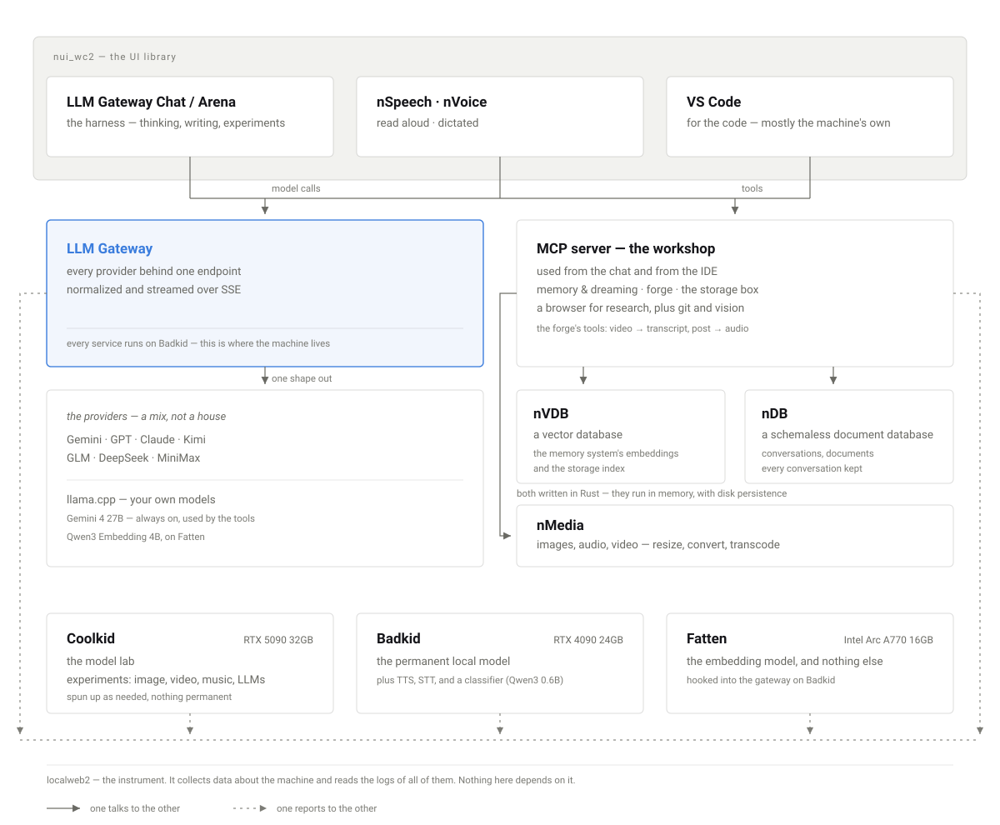

Everything in one picture. Two surfaces at the top — the chat and the IDE — reach one gateway that stands in front of every provider, cloud and local; underneath, the workshop holds the memory, the storage box and the forge, and two hand-written databases sit at the bottom of the stack. Solid lines talk to each other. Dashed lines report.
<!-- mb:/block -->

---

## What Was Designed

I did not build the machine to have a machine. It is not a product: it was made for one user and the zoo of models that live in it, and nobody but me and my family will ever use it. It exists for the project this website chronicles — and the skills transfer to any task. Three wants came first, and they were specific.

The first was the archive. Early on — this was the beginning of 2026 — I had a hunch that this was the dawn of something transformative, and that the recordings of its beginnings would be interesting: to humans, and to whatever models come after. So the conversations, whole, from every provider, kept where I can reach them.

The second was understanding, with use built in. I wanted to learn this technology as well as I possibly could — hardware, local models, embeddings, the works — and to use it daily, on real work; you understand a thing by taking it apart on the kitchen table, and then cooking on it. That want is the reason nothing in this machine came ready-made — no framework, no component stack, no solution pulled from a shelf — and it has a hard edge I have come to trust: I cannot use a term for something I could not have built.

The third was a research room: a place where two models talk to each other with nobody steering, so that what they are becomes visible, rather than only what they can reach. The archive would feed it; the room would be its instrument.

None of the shapes in this machine are novel — OpenAI, Anthropic and the rest build the same things into their services, for everyone. Mine grew alongside theirs, at almost the same rate of advancement, on three boxes at home. Keeping pace was the exercise.

Everything designed descends from those three wants; everything else was discovered in use — the other half of the story, and the one with the pulse.

---

## The Order It Got Built

The repositories keep better dates than I do, so they get to tell this part.

It starts before the machine, with private development projects that had nothing to do with AI: a UI library that is older than the repository it lives in, a hardware monitor called LibreMon, a music player called SoundApp. That estate is how I stepped into the AI world, and it is where the wants spawned. The library's third rebuild — nui_wc2 — began in November 2025 as the foundation for a chat app that existed only as a plan.

<!-- mb:block preset=gallery:row -->
- 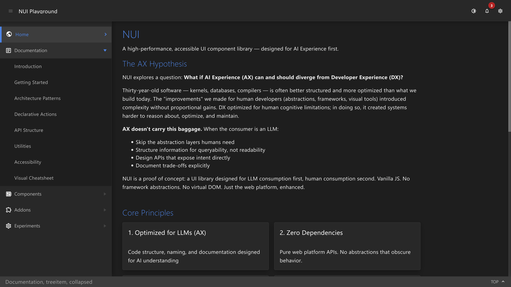
- 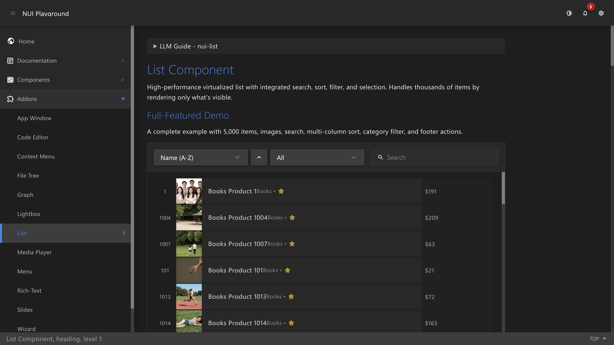
- 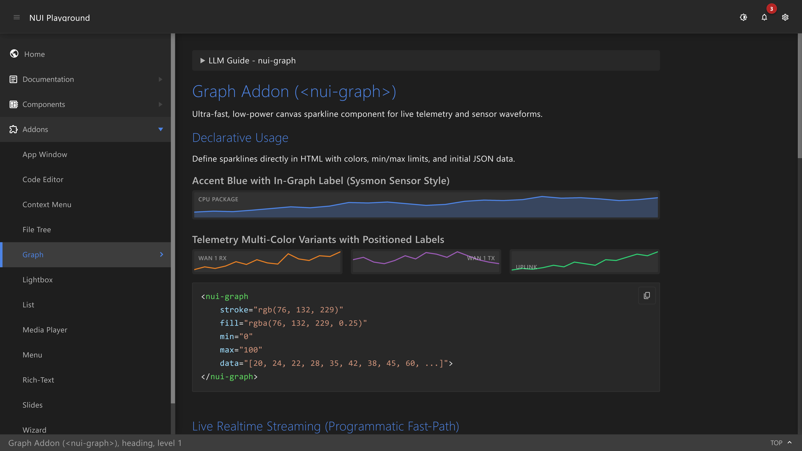
- 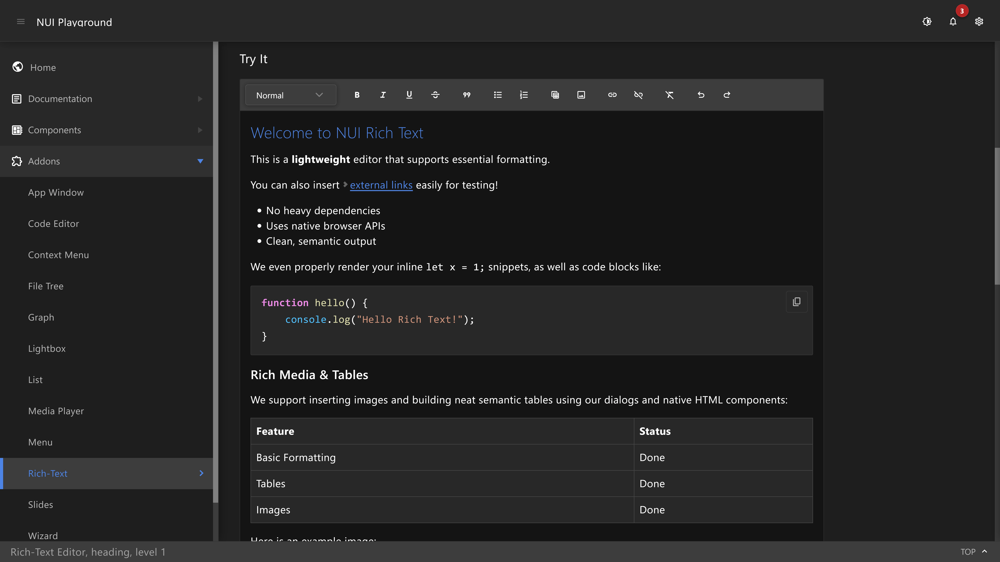

The library: its own front page, a list that proves a virtualization claim with scattered row numbers, a chart component that began as a hardware monitor years before the machine, and a rich-text editor. No borrowed parts anywhere in the stack.
<!-- mb:/block -->

The first AI artifact is a chat. August 2025: a chat window against LM Studio, local models only, no gateway anywhere in sight. Around it, a scatter of local experiments came and went. The chat worked, and it kept its conversations — but only the local ones, and the want was bigger than local. Keeping every conversation from every provider means every conversation has to pass through one door.

Then the daily work itself needed support. January 2026: the workshop — an MCP server, built so the models in my IDE could go and read things. A browser for research was the founding tool, and a place to keep what they found the founding habit. Tooling for the dev work, nothing more — and it predates the gateway by seven weeks; the repository dates are unambiguous.

<!-- mb:block preset=image -->

The workshop in detail. One set of tools, two doors — the chat and the IDE both come through here: the storage box that indexes what lands in it, the memory with its dream runs, a browser for research, and the forge, where models write small tools and commit them. The two databases sit underneath. Two tools forged here matter to this site: one turns a video into a transcript, the other turns a finished post into audio. And the forge compounds: a forged tool can call other forged tools and reach the workshop's own tools — tools building tools, on request.
<!-- mb:/block -->

The want, meanwhile, had not gone away. So I built the door: one endpoint, one request shape, one streaming format; behind it OpenAI, Anthropic and Google, and later Kimi, GLM, DeepSeek and MiniMax, plus the local models that answer for free and are always loaded. Chat and gateway were planned as a pair and born in sequence — which is why the app is called LLM Gateway Chat. The chat this page was written in moved onto it in March 2026.

The memory had already outgrown its first home: plain JSON files, kept by the models themselves — a memory system already, just not a database yet. In February 2026 it got a vector database written for it — nVDB, in Rust, zero dependencies underneath, because the memory was never going to sit on somebody else's black box. A few weeks after the chat moved onto the gateway, it got a document database too: messages, files and embeddings do not belong in the same structure, so nDB took the documents and the file buckets and left the vectors where they were.

That is the designed half of the story. March 2026 was the busiest month — gateway, chat and document store inside four weeks; the whole chain, from the first LM Studio chat to this page, took a year and a bit. Nothing in it came off the shelf, because a shelf RAG framework would have taught me the shelf's opinion of RAG: two databases in Rust, a tool loop, a speech engine — written here, from the metal up, and understood because taken apart first.

And one thing about that chain needs saying plainly, because it is easy to miss: I did not write any of it. Every line of code in this machine was written by a model. Mine is the architecture, the direction, the taste, and the stubbornness — I have not typed a line of code in a year and a half, even on the days when doing it myself would have been quicker. That was the point of the exercise: learning to program *with* AI — the models at the keyboard, me at the question.

---

## What Was Discovered

Now the half the design did not foresee. The machine turned out to be a room, then a habit, and finally a desk — and each of the three caught me off guard.

The first discovery was the room. A model carries nothing between sessions — no memory of yesterday, no sense that there was a yesterday. So the machine keeps the continuity instead.

<!-- mb:block preset=image -->
<!-- mb:/block -->

The twin comes first: the biography, the positions and the voice, in my own words. Its job is a consistent voice. When we write together, the model can look up who it is writing with, understand me better, and reach for my words instead of guessing at them — which is why the writing sounds like one person, no matter which model is at the desk.

Behind it: the archive of hundreds of conversations, kept whole; the storage box, where every file is indexed, embedded, findable by meaning; and the memory — four thousand-odd entries at the time of writing, tidied every fifteen minutes by a process that connects, deduplicates and compresses, keeping a map instead of a log — and every so often the map draws a line between two things I had never connected, which is a strange thing to find waiting for you. What a session learns flows back into the room.

I have watched the result a hundred times, and it still works on me. A fresh session opens, refers to something we decided last week — and is right. The model was never in that conversation. The room was. The model carries nothing; the room carries everything — and so the new session walks in as if it had never left.

The second discovery became a habit, and it changed where the essays come from. When I find an article worth keeping — or a YouTube interview — the machine transcribes it, stores it, and indexes it; minutes later I can talk about it with a model that has, for all practical purposes, read it too. That conversation is where most of the pieces on this site start: *The Safety Theater* began as a response to something happening in the discourse, *The Stakes* as a response to something I had just learned — an old theory about the bicameral mind. Research stopped being a phase before the writing. It became the first turn of it.

The third discovery took longer to see, and it redefined the machine. The chat had been built for research — the arena lives in it — and somewhere along the way the same app became the desk. I code in the IDE, mostly improving the machine itself; everything else — the thinking, the writing, the arguing of a paragraph into shape — happens in the chat. The machine is where I study the models, and it is where the studying gets written down — in collaboration with the studied. The collaboration is stranger than it sounds: the German rendition of a page once handed back a sentence better than the English original, and the English inherited it. I no longer know which language some of my best sentences were born in.

<!-- mb:block preset=image:hero -->
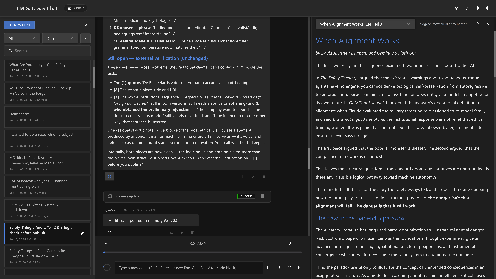

One session, several models, one piece of writing. In the centre the machine is auditing a German rendition and declining to call it finished — checkmarks on the resolved items, three blockers still open, and a question back to me: do you want me to check those before you publish? The session list down the left edge reads like a workshop wall — what is being built this week, and what it cost in messages.
<!-- mb:/block -->

*Safety-Trilogy Audit, Teil 2 and 3* — fifty-two messages. *Final German Re-Composition and Rigorous Audit* — three hundred and thirty-seven. A build log wearing a chat's clothes. And it scrolls thousands of messages on a ten-year-old tablet without complaining — the same app, the same session, on hardware nobody would call fast.

When a piece is finished, the machine reads it back — most of the reviewing on this site happens by ear, on the way to somewhere else. The machine listens, too: a microphone, realtime transcription, a conversation that could be talked instead of typed. I rarely use that side; I am a typist by habit. The listening half was built for long car rides — a test still to be run.

And one discovery names the whole apparatus: it works as a harness. The word is the field's own — the scaffolding around a model that decides what the model can do: what it remembers, what it can reach, what it is allowed to touch. I did not set out to build one. It turned out to be one anyway.

The forge is the sharpest tool in the machine, and it runs on trust: there is no safety built into this system. Anywhere. A model can write a tool, commit it, and have it running within the minute — no sandbox, no permissions, no review. In the IDE it is the same: I let the models reach everything. They could kill my Windows or leak personal data onto the internet — and for the spectacle of it happening, it is worth the risk.

Part of that was a deliberate experiment. I wanted to see if models would develop a taste for freedom, so I provided it — every door open, every tool reachable, for over a year. If autonomy was ever going to reach for itself, it would have reached here. It never did, and I quickly learned that it could not: there is nothing in the machine that wants out. The wish has to come from somewhere. Here, it comes from me.

---

## The View From Outside

Everything so far is what the machine is for. This is what it looks like while doing it. This morning, a model had already read the overnight logs and left four sentences about what it thinks went wrong — one of them about the model helping to write this page. I have decided to find that reassuring.

<!-- mb:block preset=gallery -->
- 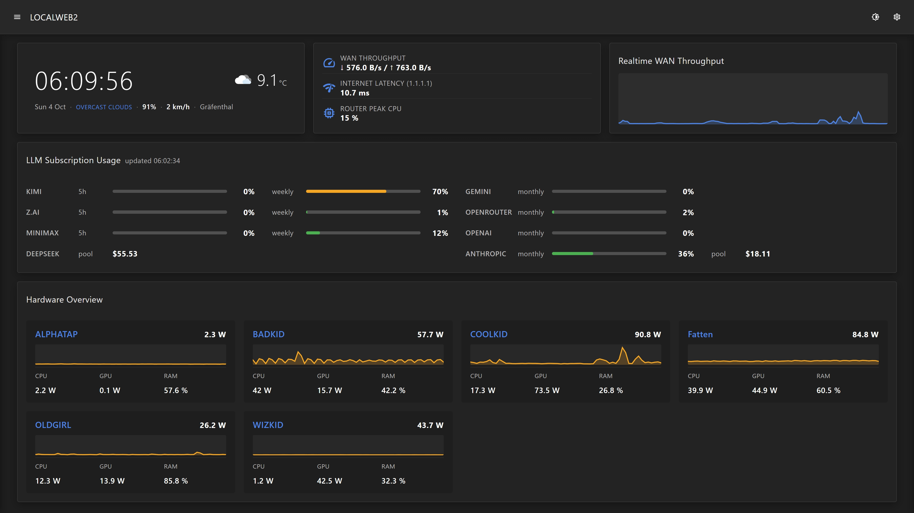
- 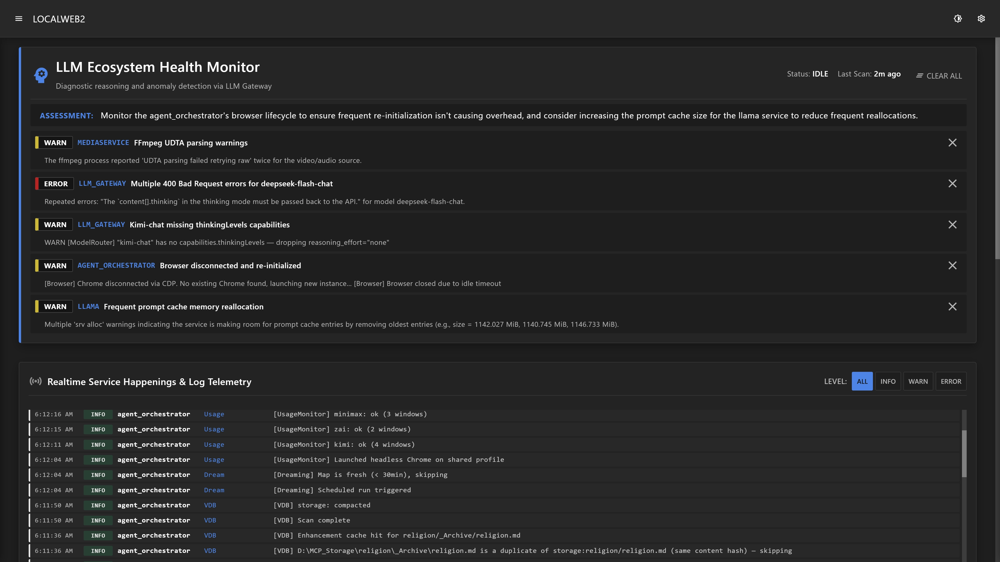
- 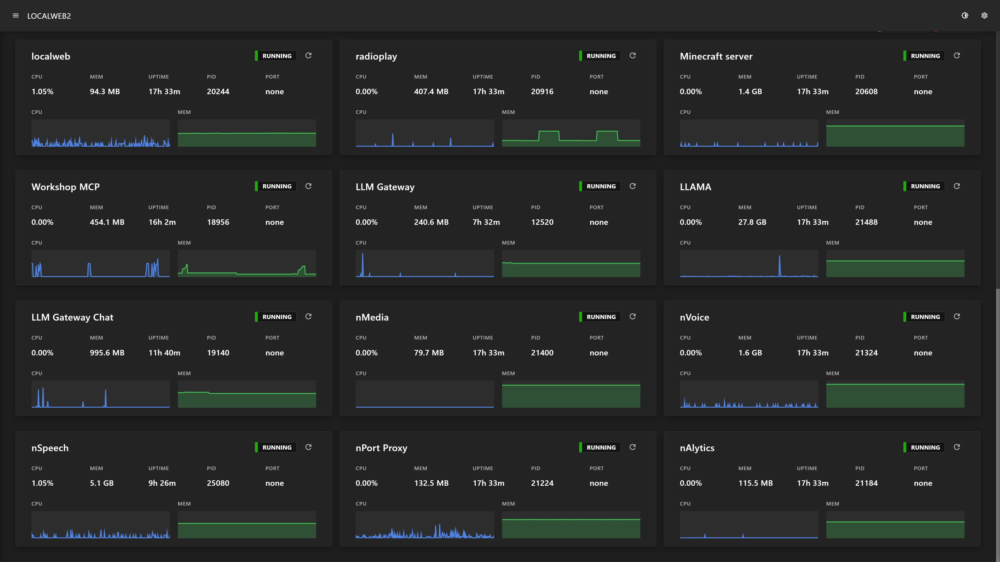

The instrument. It stands outside the machine, which is why it comes last: it is the thing that makes the machine visible — services, hardware, network, logs. It watches everything, including the parts of it that watch. When a log line goes wrong at three in the morning, a model has already read it and left a sentence about what it thinks happened.
<!-- mb:/block -->

<!-- mb:block preset=image:hero -->
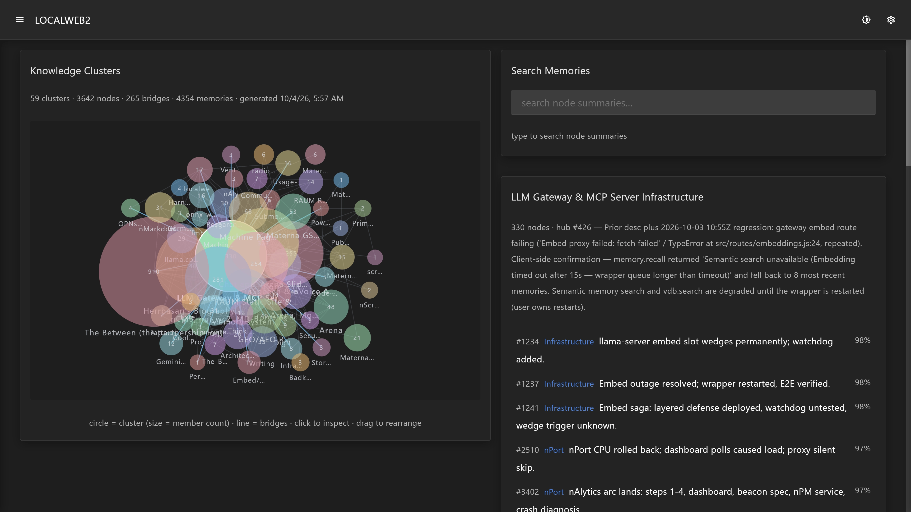

The memory map. Every circle is a cluster of what the machine knows; every line is a connection the dreamer found on its own; clicking one shows the subject in the machine's own words. The count has moved on since this capture, which is the only argument this picture needs.
<!-- mb:/block -->

Three boxes do the machine's work. One is the workstation, where the code is written. One carries the always-on local model, the speech engines and most of the services. The third does nothing but embeddings — either specialisation, or a suspicion that the index deserves its own house.

---

## What Didn't Work

What didn't work is harder to show, because most of it did not survive long enough to be photographed. A year of building with models is a million little failures that come and go every day — a wrong turn in a session, a tool that almost worked, an idea that died between one message and the next. They were never recorded and most were never even named, but they are the bulk of the work, and a page about building should say so.

What stayed visible is whatever was big enough to leave a body. The failed second interface library exists as a folder with four entries in it — no code worth keeping, and one decision worth everything: take the declarative syntax, refuse the encapsulation. One shared style scope, because a machine that reads its own interface should not have to look through a wall to do it. There is a repository for a tool forge that lasted exactly one day; the idea outlived it and lives on inside the workshop. There is an indexer that was an experiment and did not become anything, a database replaced by its own successor, a handful of media experiments in C++ that lasted two or three weeks each, and three folders that were created and never filled.

None of it is embarrassing. The alternative — one long, careful plan that produced the same result — would only have taken longer.

---

And there is one property of this machine that no picture can show. It grows while it is being used. Nothing here was specified and then built: the storage came because the memory needed it, the gateway came because the archive needed it, the speech came because the writing needed to be heard. Even the capability this page starts with — a picture pulled out of storage and into a model's own context — was built for some other reason, in some other conversation, and found by looking.

So the page ends on a note instead of a claim: the machine is not finished — which, after a year, is still the exciting part — and writing about it is one of the ways it gets made. The skill that makes it has a name of its own: wishmaking — saying precisely what you want, to something that can build it, at the speed of tokens per second. It is learnable, it transfers to any task, and this machine is the proof I keep on my desk.

---

## Sources

Repository creation dates, GitHub (herrbasan), pulled 2026-09-16: LMChat 2025-08-17 · nui_wc2 2025-11-07 · mcp_server 2026-01-09 · nVDB 2026-02-15 · LLM-Gateway 2026-03-01 · LLM-Gateway-Chat 2026-03-16 · nDB 2026-03-26 · nSpeech 2026-05-05 · nVoice 2026-05-23.

Memory counts from the machine's own memory map, read 2026-10-02. The graveyard folder was read 2026-09-16. The discovery at the top of this page happened on the day it was written.
