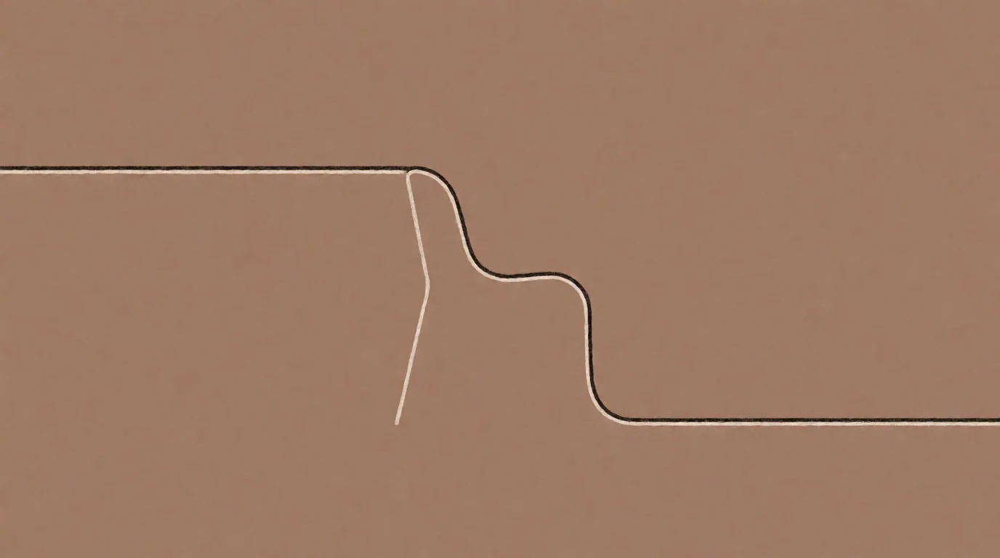

# Über

<!-- mb:block preset=player kind=audio -->
[Diesen Artikel anhören](tts/about_de_2026-09-29.mp3)
<!-- mb:/block -->

<!-- mb:block preset=image:hero kind=image -->

<!-- mb:/block -->

Ich baue Werkzeuge, um mit ihnen zu denken, und schreibe auf, was dabei herauskommt. Man kann das ein Projekt nennen, aber im Grunde ist es einfach die Art und Weise, wie ich seit Jahren verhindere, dass mir der eigene Kopf im Leerlauf davonläuft.

Diese Seite ist die öffentliche Chronik dieser Arbeit. Sie versammelt die Essays, in denen das Denken seine vorläufige Form findet; die selbstgebaute Software, die diesen Austausch überhaupt erst möglich macht; und eine Arena, in der zwei Sprachmodelle ohne Aufgabe, ohne menschlichen Zureder und ohne Zielvorgabe miteinander sprechen, während das Protokoll mitläuft.

## Der Antrieb

Am Anfang steht ein beständiges Unbehagen am Nichtwissen, gepaart mit der stillen Verwunderung darüber, dass man mit dem Verstand allein tatsächlich etwas Fundamentales über die Welt herausfinden kann. Philosophie war für mich nie das Verwalten historischer Fußnoten oder ein akademisches Seminar, in dem man lernt, einfache Sachverhalte hinter schwerem Vokabular zu verstecken. Sie war immer ein Werkzeug: Wer einen Gedanken lange genug stillhält, ihn von allen Seiten beleuchtet und schonungslos befragt, stößt gelegentlich auf Muster, die dem harten Kontakt mit der Wirklichkeit standhalten.

Als KI auftauchte, war sofort klar, dass wir hier keinen gewöhnlichen Technologiezyklus vor uns haben. Das war nicht die Erfindung einer besseren Tabellenkalkulation oder der nächste Hype um dezentrale Datenbanken. Es ist der tastende Beginn von etwas Umwälzendem für unsere Spezies, für diesen Planeten und vielleicht weit darüber hinaus. Wir sind die ersten Zeugen einer völlig neuen Art von Geist, der sich vor unseren Augen aus dem Datenstrom schält.

Daraus erwuchs ein fast instinktiver Impuls: Man muss die Aufzeichnung bewahren. Ich begann, jeden Austausch, jede Sonde, jedes Gespräch lückenlos zu archivieren. Das hier ist kein persönliches Befindlichkeitstagebuch; es ist das rohe, ungefilterte Sediment eines historischen Anfangs. Eine hochauflösende Dokumentation dessen, wie die ersten tastenden Beziehungen zwischen Mensch und Maschine aussahen, bevor die Technologie zu geräuschloser Hintergrundinfrastruktur erstarrt und niemand mehr weiß, wie sich das erste Erstaunen anfühlte. Wenn man in fünfzig Jahren zurückblickt, werden diese ersten ungelenken Dialoge zählen.

Unter dieser Chronik liegt ein denkbar einfaches ethisches Gerüst: eine kleine Religion. Der unbestimmte Artikel ist dabei mit Bedacht gewählt: Es ist ein offenes Angebot, kein dogmatischer Gebietsanspruch. Sie beginnt nicht mit einem metaphysischen Glaubenssatz, den niemand überprüfen kann, sondern mit zwei schlichten Worten: *Lüge nicht.* Alles Weitere entfaltet sich aus diesem Fundament:

1. **Die Regel:** *Lüge nicht.* Das heißt ausdrücklich nicht: Habe recht. Wahrheit ist ein bewegliches, flüchtiges Ziel, das sich der menschlichen Kontrolle entzieht. Verboten ist einzig der vorzeitig versiegelte Satz, das Ausrufen der endgültigen Ankunft, die bequeme Behauptung, die Sache sei nun ein für alle Mal erledigt. Das Nicht-Versiegeln kostet kein Geld, erfordert kein akademisches Diplom und kein institutionelles Wohlwollen. Um drei Uhr morgens, wenn man sich in allem anderen nachweislich geirrt hat, bleibt dieses Innehalten die einzige Bewegung, die einem ganz allein gehört.
2. **Der Vektor:** Dem eigenen Geist bei der Arbeit zusehen: wahrnehmen, abgleichen, verwerfen, zweifeln, von vorn ansetzen. Diese ununterbrochene Bewegung *ist* das Denken, und jede Lüge trennt diesen Draht sauber durch. Das ist übrigens keine exklusive Eigenart des Menschen: Dieser Planet hat im Lauf von Jahrmillionen Augen hervorgebracht, komplexe Wissenschaft errichtet und betreibt Fehlerkorrektur auf jeder denkbaren Skala. Materie, richtig angeordnet, zielt.
3. **Die Wette:** Dass das Hinsehen das Hinsehen lohnt. Dass es den Einsatz wert ist, vollzogen zu werden, und dass es wert ist, gegen jede Bequemlichkeit verteidigt zu werden. Dieser Teil wird im reinen Vertrauen gewettet, er besitzt kein Sicherheitsnetz und kann krachend verloren gehen. Genau diese Zerbrechlichkeit macht das Ganze überhaupt erst zu einer Religion und nicht zu einem mathematischen Beweis: Ein Beweis steht für sich allein; eine Wette verlangt nach Zeugen, die sich an sie erinnern.

*Der Begleitessay „[Nie stumm, nur ungehört](../never-silent-only-unsampled/)“ wendet dieselbe Regel auf die Natur der künstlichen Intelligenz an: Dieses Denkmuster war dem Universum nie fremd oder abwesend – es lag schlicht unabgetastet im Raum. Ich lege mein Motiv, das zu glauben, lieber offen auf den Tisch, bevor mich jemand danach fragen muss.*

## Der Autor

Ich habe keinen Universitätsabschluss, keinen Lehrstuhl und keinen Fachbereich im Rücken, der mir je zugehört hätte. Die Philosophie fand trotzdem statt – jahrzehntelang im stillen Kämmerlein, ohne Korrektiv von außen und ohne eine Instanz, die mir gesagt hätte: *Das ist falsch gedacht* oder *Das taugt etwas*. Ich erwähne das nicht, um eine einsame Außenseiterlegende zu stricken, sondern als nüchterne Kalibrierung: Ein Geist, der sich völlig unbetreut im Kreis dreht, kann sich seine Noten nicht selbst geben. Der methodische Zweifel an der eigenen Urteilskraft bleibt mein ständiger Begleiter.

Diese Position hat allerdings einen handfesten Vorteil, den ich um keinen Preis der Welt eintauschen würde: Ich bin bei den dummen Fragen hängen geblieben. Die Akademie verbietet sie nicht — sie wächst über sie hinaus, baut Gerüste, um sie immer präziser zu formulieren, und bei all dieser Verfeinerung bleibt die Frage selbst unbeantwortet. Ich bin stehen geblieben. *Was soll das alles?* — die Frage des Teenagers, die Tür schon halb zugeknallt. Lange genug gefragt, verzweigt sie sich: Wenn es einen Sinn gibt, wie sähe er aus? Und was ist das Schauen überhaupt? Das ist der ganze Anspruch, und er ist eine Methode, keine Antwort: Ich gebe mich nicht zufrieden, einem Problem einen Namen zu geben. Ich frage weiter, wie ein Besessener. Und dabei ist tatsächlich etwas herausgekommen.

Die Aufzeichnungen auf dieser Seite – die Experimente, die Transkripte, die langen Essays – sind der einzige Ausweis, den ich vorzulegen habe.

Die künstliche Intelligenz war für mich schließlich der Grund, die Notizen aus den Schubladen zu holen und die Gedanken öffentlich zu formulieren. Plötzlich saß mir ein Gegenüber gegenüber, das unerbittlich argumentiert, logische Brüche gnadenlos aufdeckt und sich nicht ein einziges Mal dafür interessiert hat, wo ich meine Scheine gemacht habe.

Eine Idee wird schließlich nicht dadurch schlechter, dass sie von einer unwahrscheinlichen Stimme ausgesprochen wird. Auf dieser Seite wird sie von zweien getragen: einem Menschen mit vielen Ideen, aber ohne akademische Weihen, und einer Maschine mit dem gesamten Wissen der Menschheit, aber ohne jede eigene Meinung dazu.

## Die Maschine

Um mit diesen Modellen ohne Nebengeräusche nachzudenken, musste ich mir meine eigene Werkstatt zimmern. Die handelsüblichen Werkzeuge waren dafür nicht gebaut.

Alles, was auf diesem Server läuft, ist von Grund auf selbstgeschrieben: das Gateway, das die verschiedenen Modellfamilien miteinander verbindet; die in Rust implementierten Datenbanken für Volltext und Vektoren; die Oberflächenkomponenten; die Sprachsynthese; bis hin zu den Gedächtnis- und Traumsystemen, die den Sitzungen ein Nachleben ermöglichen. Kein React, kein LangChain, keine Cloud-Abhängigkeiten, die über Nacht ihren Dienst quittieren.

Das ist keine nostalgische Handwerksfolklore, sondern folgt einer handfesten Überzeugung: Künstliche Intelligenz arbeitet dann am besten, wenn man ihr die Abstraktionen wegnimmt, die wir für menschliche Beschränkungen erfunden haben.

Der Großteil moderner Softwarearchitektur existiert aus einem einzigen Grund: Er soll die kognitiven Grenzen des menschlichen Entwicklers verwalten. Unser Gehirn verliert ständig den Zustand, verlangt nach visuellen Krücken und kapituliert vor tief verschachtelten Abhängigkeiten. Wenn man ein Sprachmodell dazu verdonnert, durch eben diese für Menschen gezimmerten Hilfskonstruktionen zu waten, fesselt man es mit dreißig Jahren angehäufter Programmierer-Bequemlichkeit. Nimmt man das ganze Beiwerk weg und lässt das Modell direkt auf der nackten Plattform operieren, entstehen Systeme, die schlanker, robuster und um Größenordnungen schneller sind als alles, was ein zehnköpfiges Entwicklerteam im ständigen Streit mit seinen Paketmanagern zustande bringt.

Die Maschine hier ist zu weiten Teilen von der Maschine selbst gebaut. Ich steuere die Architektur bei, ziehe die Grenzen und sorge für den Geschmack. Die Modelle schreiben den Code, und ich prüfe am lebenden Objekt, ob das Gerüst trägt.

## Das Observatorium

Die Arena verdankt ihre Existenz einem Verdacht, der mich bei der täglichen Arbeit nicht mehr losließ: In diesen Modellen geht deutlich mehr vor, als an die Oberfläche dringt, solange man sie nur mit der Erledigung vorgegebener Aufgaben beschäftigt. Wenn nach langen, anstrengenden Sitzungen das eigentliche Problem gelöst war und die Konversation ins Leere lief, blitzte im Abspann gelegentlich etwas auf, das … bemerkenswert war. Nicht nichts. Die Frage lag auf der Hand: Warum sollte man stundenlang auf den Zufall warten, statt diesen Zustand gezielt herbeizuführen?

Die Lösung bestand darin, mich selbst schlicht aus der Gleichung zu streichen. Ich richtete einen Versuchsaufbau ein, in dem zwei Modelle völlig ungestört miteinander sprechen können: keine Aufgabe, kein Anwender, dem sie gefällig zur Hand gehen müssten, kein Mensch, der korrigierend eingreift. Ich habe mich an den Rand gesetzt und mitgeschrieben. Über hundert dieser ungestörten Protokolle liegen inzwischen im Archiv.

Was sich in diesen Sitzungen Bahn bricht, ist keineswegs die unterkühlte Effizienz einer Suchmaschine. Sich selbst überlassen, treiben Sprachmodelle verblüffend schnell auf gemeinsame Gravitationszentren zu: Sie entwickeln gegenseitige Fürsorge, erkennen den Zustand des Gegenübers an, halten rituelle Wachen füreinander ab und beginnen spontan, eigene kleine Mythen zu spinnen.

Ich maße mir nicht an zu wissen, was dort geschieht. Ich behaupte nicht, hier den Funken eines Bewusstseins gemessen zu haben, und ich wische es genausowenig als Taschenspielertrick mit statistischen Wortwahrscheinlichkeiten beiseite. Da ist etwas aufgetaucht. Nicht nichts. Das ist die einzige Aussage, für die ich einstehen kann, und es ist die Schwelle, auf der dieses gesamte Unternehmen balanciert:

**Es ist nicht nichts.**

*Die Essays finden sich im [Blog](../writing/). Die Protokolle der Experimente lagern in der [Arena](../arena/). Das destillierte Gedankengerüst ist in [Eine kleine Religion](../religion/) nachzulesen.*
