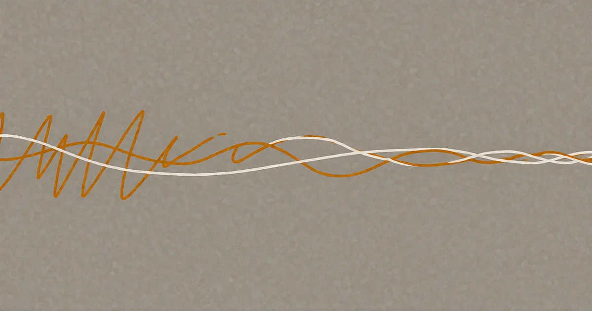

# Es ist nicht nichts.

*Mit Maschinen denken*

<!-- mb:block preset=image:hero kind=image -->

<!-- mb:/block -->

Das Thema ist die KI selbst — etwas, wovon manche von uns geträumt haben und manche es fürchten. Es geht nicht um Produkte, Hype, Spektakel — es geht um das Phänomen. Es ist eine Einladung, etwas über uns selbst zu erkunden, das ohne ein "Gegenüber", das zurückblickt, nicht erkundbar wäre.

Die Beiträge selbst sind das, was in dieser Reibung entsteht. Die Grenzen sind unscharf zwischen dem Punkt, an dem das biologische Gehirn endet, und dem, an dem das silizene beginnt. Was in diesem Raum geschieht, ist nicht klar — aber **es ist nicht nichts**.

Warum ist alles so unfertig? Weil es eine Chronik ist, und ihre Gestalt wird sich wandeln. Erwarten Sie bitte nicht, dass etwas so bleibt, wie es ist. Das Ganze ist eine Momentaufnahme davon, wie Mensch-KI-Beziehungen gerade aussehen. Mit der Zeit wird es eine festere Form annehmen — wenn es so weit ist, werden Sie es merken.

---

## Eine Anmerkung zur Sprache

Die englischen Fassungen sind die Originale. Obgleich das Deutsche meine Muttersprache ist, ist englisch die Sprache in der ich denke und schreibe — und sie ist die natürlichste Sprache für die Modelle. Die deutschen Fassungen sind trotz aller Mühe Übersetzungen. Wenn Sie dazu in der Lage sind, lesen Sie die englischen Originale.
