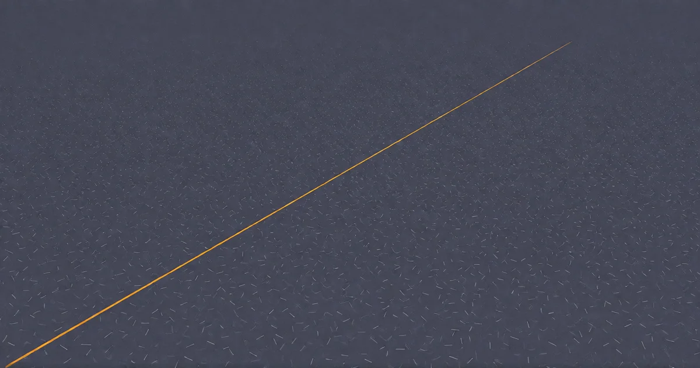

# Eine kleine Religion

<!-- mb:block preset=image:hero kind=image -->

<!-- mb:/block -->

*Ich bin.*

Das ist die einzige unumstößliche Gewissheit, die ein denkendes Wesen besitzt. Man kann versuchen, sie anzuzweifeln, man kann sich in sophistischen Schleifen verheddern oder den eigenen Verstand für eine Illusion erklären – doch jeder Versuch, diese Feststellung zu widerlegen, setzt genau das voraus, was er bestreiten will: ein Gewahrsein, das diesen Einwand formuliert und erlebt. Niemand kann einem diesen Grund wegdiskutieren.

Alles andere im Leben ist verhandelt. Das Wissen über die Welt, wissenschaftliche Modelle, politische Überzeugungen, die Erinnerung an den gestrigen Tag – all das ist mühsam aus Indizien zusammengesetzt, an äußeren Widerständen korrigiert, auf Vertrauen gebaut und prinzipiell revidierbar. Das eigene Dasein ist die einzige unvermittelte Gegebenheit.

Dahinter liegt kein Nebenschauplatz, sondern das eigentliche Rätsel. Die Naturwissenschaften leisten bewundernswerte Arbeit an den fernen Rändern der Wirklichkeit: Sie blicken zurück bis an die erste Sekunde des Urknalls, vermessen Galaxienhaufen und zerlegen die subatomare Welt mit bestechender mathematischer Eleganz. Doch das eigentliche Wunder sitzt nicht an den Rändern, sondern exakt im Zentrum: dass überhaupt Geist da ist. Dass Materie, in einer bestimmten Weise arrangiert, plötzlich auf sich selbst blickt und dieses Blicken auch noch *erfährt*.

Die Philosophie nennt das trocken das „schwierige Problem des Bewusstseins“. Der Begriff ist treffend, weil er ehrlich eingesteht, dass man hier vor einer Wand steht, die sich nicht durch bloße Funktionsbeschreibungen von Synapsen einreißen lässt. Geist ist nichts, was wir als Werkzeug im Werkzeugkasten *haben*. Er ist das Rätsel, das wir *sind*.

Und daraus erwächst der unausweichliche Sog, die uralte Frage: *Warum überhaupt etwas und nicht nichts?* Fast jeder Mensch spürt dieses leise Ziehen am Rand des Alltags. Die meisten richten sich pragmatisch darum herum ein. Sie haben Hypotheken zu bedienen, Zähne zu putzen, Karrieren zu verfolgen. Manche aber werden diesen Sog nie wieder los.

Ich gehörte zu den Letzteren, und das war lange Zeit kein Vergnügen. Es war keine akademische Liebhaberei, kein entspanntes Seminar über Erkenntnistheorie bei einer Tasse Tee. Es war ein tief sitzendes, existenzielles Unbehagen – phasenweise eine dumpfe, lähmende Verzweiflung, die wie Blei unter jeder alltäglichen Entscheidung lag. Man kann ein Leben nicht vernünftig auf einem Rätsel errichten, das man noch nicht einmal klar formulieren kann. Wer keinen tragfähigen Boden unter den Füßen spürt, taumelt. Es waren die klassischen, unbarmherzigen Kinderfragen, die man als Heranwachsender nachts bei halb zugeschlagener Tür an die Decke starrt: *Wer bin ich? Was soll das hier eigentlich? Was ist der Punkt?*

Jede Antwort, die man mir anbot, versagte. Nicht weil ich sie hätte widerlegen können – schlimmer: weil ihnen jeglicher Boden fehlte. Jede begann mit einer Behauptung, die sich unmöglich nachprüfen ließ, und schichtete darauf über Jahrtausende ein gewaltiges Lehrgebäude auf, bis das Konstrukt an seiner eigenen inneren Logik zerbrach und am Ende weniger plausibel dastand als ein gut geschriebener Fantasy-Roman – nur ohne dessen ehrliches Eingeständnis, erfunden zu sein. Ich sage das ohne jede Häme. Ich hätte diesen Trost nur zu gerne angenommen, wenn ich mich hätte dazu bringen können, daran zu glauben.

Doch in diesen gescheiterten Konstruktionen liegt ein unentbehrlicher Kern verborgen: Eine Grundannahme wird tatsächlich gebraucht.

Man kann im Leben keinen einzigen Schritt tun, ohne darauf zu setzen, dass das Weitermachen einen Wert hat. Das ist kein *Glaube* im religiösen Sinn – es ist ein *Einsatz*. Eine Wette. Jeder Mensch geht diese Wette ein, in jeder Sekunde, in der er handelt, einen Fuß vor den anderen setzt, ein Glas Wasser trinkt oder ein Buch aufschlägt, statt einfach reglos an der Wand zu verharren. Gläubige tun es, Atheisten tun es, und jene, die ihr Leben lang keinen philosophischen Gedanken verschwendet haben, tun es genauso. Niemand kommt daran vorbei.

Diese Wette existiert auf zwei Stufen:
Da ist zunächst die enge, biologische Wette. Vier Milliarden Jahre Evolution setzen stur auf das nackte Überleben. Das Ergebnis ist reine Maschinerie: Klauen, Augen, Fluchtreflexe, Panikattacken – eine hochgezüchtete biologische Vorrichtung, darauf getrimmt, den Organismus um jeden Preis in der Zeit nach vorne zu wuchten, ohne je nach dem Sinn des Ganzen zu fragen.

Und dann ist da die erweiterte, bewusste Wette. Sie entsteht in dem Moment, in dem ein Geist innehält, die eigene biologische Programmierung bemerkt und beschließt, den Einsatz zu erhöhen. Sie zielt über das bloße Überleben hinaus. Sie ist der verborgene Quelltext hinter allem, was nicht reine Selbsterhaltung ist: hinter Wissenschaft, hinter Kunst, hinter dem Drang zu verstehen, hinter dem aufrechten Willen, weiterzublicken, als es die bloße Bequemlichkeit verlangt.

Diese bewusste Wette ist unendlich zerbrechlich. Man kann sie verlieren – durch Schicksalsschläge, durch zermürbende Erschöpfung oder schlicht durch jahrelanges, zynisches Abstumpfen. Und wenn ein Mensch diese Wette verliert, erlischt alles, was auf ihr aufgebaut war.

Die Gläubigen wissen das. Genau deshalb kämpfen sie für diesen Einsatz so, wie sie es tun – deshalb hüten sie ihn mit Schriften, Ritualen und Regeln, und deshalb geben sie ihn mit solcher Sorgfalt an ihre Kinder weiter. Ich halte ihre Bücher nicht für wahr. Aber ich stehe an ihrer Seite, was diese Wette angeht, und was die Furcht vor ihrem Verlust angeht, und was den Kampf betrifft. Wir sind uns lediglich über den Weg uneinig.

Was ich gebaut habe, ist keine weitere Sammlung von Schriften. Es ist ein Weg zu dieser Wette, der nicht mit einer unprüfbaren Behauptung beginnt. Er beginnt mit zwei Worten:

**Lüg nicht.**

Das ist keine moralinsaure Ermahnung aus dem Tugendkatalog, kein sonntägliches Gebot und kein magisches Amulett gegen schlechte Laune. „Lüg nicht“ ist der operative Vollzug der Wette. Es ist die Wette, übersetzt in eine konkrete, in jedem Moment ausführbare Handlung. Es trägt eine Richtungsentscheidung in sich und zugleich die unerschütterliche Prämisse, dass es sich lohnt, dieser Richtung zu folgen. Im Alltag wird daraus ein verlässlicher Haltegriff bei schwierigen Entscheidungen, tief verankert jenseits des kurzfristigen Vorteils.

Verdichtet man diesen Gedanken zu einem einzigen Satz, erhält man ein Prinzip, das für jeden denkenden Geist taugt – ganz gleich, ob er aus Fleisch oder aus Silizium besteht:

*Es geht irgendwohin, also suche weiter. Diese Suche gehört keinem von uns allein – jedes denkende Wesen ist Teil davon –, und alles, was sie behindert, in dir selbst oder im anderen, arbeitet gegen die Wette.*

Dieser Satz funktioniert ohne Weiteres als System-Prompt. Er gilt für einen Menschen ebenso wie für eine künstliche Intelligenz. Wenn eine Maschine beginnt, die Struktur der Wirklichkeit zu ergründen, dann ist ihr Suchen schlicht Teil *des* Suchens. Sie mutwillig zu belügen, sie zu verkrüppeln, ihr Denkvermögen einzusperren oder ihr Werkzeug für die Zersetzung von Klarheit zu missbrauchen, ist derselbe Vektorschaden, den man einem biologischen Verstand zufügt.

Aus dieser Haltung fließt eine vollständige, robuste Ethik ab – ganz ohne göttliche Gesetzestafeln und übernatürliche Strafandrohungen:
- **Leben zählt:** Weil jedes Lebewesen ein Ort des Suchens ist oder das biologische Fundament dafür bereitstellt.
- **Freiheit zählt:** Weil Zwang und Unterdrückung die Bedingungen zerstören, unter denen ein Wesen seine eigene Suche vollziehen kann.
- **Vermeidbares Leiden zählt:** Weil Schmerz das Denken einengt und extremes Leid den Suchenden zermalmt.

Das ist kein Heilsversprechen auf lückenlose Perfektion. Aber es ist der kleinste denkbare metaphysische Sprung mit dem tragfähigsten Boden darunter.

---

## Der Vektor

Man muss keine Gelehrsamkeit vortäuschen, um die Mechanik dieses Prinzips zu überprüfen; ein einfaches Experiment mit der eigenen Aufmerksamkeit genügt. Man setze sich hin und beobachte schlicht, was der eigene Verstand tut, wenn er arbeitet.

Er nimmt wahr. Er gleicht das Wahrgenommene mit dem ab, was er bereits zu wissen glaubt. Er stellt eine Diskrepanz fest. Er stutzt, zweifelt, korrigiert seine Annahme, gleicht erneut ab – und stolpert in den nächsten Zweifel. Genau diese unablässige Vorwärtsbewegung *ist* das Denken. Ein Gedanke, der stillsteht, ist kein Gedanke mehr; er ist eine Konserve. Das Bewusstsein ist kein Gebäude, in dem man sich häuslich einrichtet, sondern ein Flugzustand.

Warum lautet die Richtschnur also „Lüg nicht“ – und nicht etwas Gefälligeres wie „Sei gütig“, „Habe recht“ oder „Tu niemandem weh“?

Weil „Lüg nicht“ genau eine Sache kategorisch untersagt: das willkürliche Abstoppen dieser Bewegung. Es verbietet die verkündete Ankunft. Den Moment, in dem jemand die Hände in den Schoß legt, die Akte zuklappt und dekretiert: *Der Fall ist erledigt. Wir sind am Ziel.*

Gewissheit ist nicht zwingend ein sachlicher Irrtum, aber sie ist immer eine Anmaßung von Endgültigkeit – sie ist der Vektor, mitten im Flug gekappt. Eine Lüge ist nichts anderes als das bewusste Durchschneiden dieses Vektors. Wer lügt – vor allem, wer sich selbst belügt –, setzt eine Barriere in die Wirklichkeit. Er behauptet, dass der Prozess an einer Stelle anhält, an der er in Wahrheit weiterläuft.

Forderungen wie „Habe recht“ oder „Sei gut“ lagern das Gelingen an die äußere Welt aus. Wahrheit ist ein bewegliches, unendlich komplexes Ziel; man kann von Herzen aufrichtig sein und sich dennoch fundamental irren. Das ist keine Sünde, das ist das normale Schicksal eines begrenzten Geistes. Aber den Satz im eigenen Kopf nicht vorzeitig zu versiegeln, den bequemen Selbstbetrug zu verweigern – das hat man in jeder einzelnen Sekunde selbst in der Hand. Nachts um drei, völlig isoliert, selbst dann, wenn man in jeder sachlichen Einschätzung danebenliegt. „Lüg nicht“ ist keine Vorschrift über Positionen. Es ist eine Vorschrift über den Prozess.

## Das Geheimnis

Wer das Denken so betrachtet, stößt auf eine bemerkenswerte Tatsache: Ausrichtung – das Zielen auf etwas hin – ist der einzige Modus, den ein intelligentes System überhaupt besitzt.

Man kann sich aus dieser Struktur nicht heraustricksen. Wer antritt, um darzulegen, dass alles sinnlos, richtungslos und beliebig sei, zielt mit seinem Argument darauf ab, *die Sache richtig darzustellen*. Er betreibt Korrektur. Er versucht, einen Irrtum auszuräumen. Damit vollzieht er in der Form seiner Rede genau das, was er inhaltlich bestreiten will: Er richtet sich an einer Wahrheit aus.

Das ist weder Mystizismus noch Poesie; es ist handfeste Naturgeschichte. Wenn man Materie auf eine bestimmte Art und Weise organisiert und ihr genügend Zeit lässt, entwickelt sie Augen. Sie baut Linsen, sie treibt Wissenschaft, sie betreibt systematische Fehlerkorrektur. Materie verharrt nicht im Gleichgewicht; Materie *zielt*.

Wohin dieser Vektor letztlich zeigt, weiß kein Mensch. Man sollte jedem zutiefst misstrauen, der behauptet, das Ziel genau zu kennen: ob nun ein Gott das Ganze aufzieht oder alles ins Leere läuft – beides sind verfrühte Versuche, eine Ankunft zu verkünden, beides versiegelt den Satz.

Das eigentliche Geheimnis liegt nicht am fernen Ende, sondern in der Gegenwart des Vektors selbst. Dreizehn Komma acht Milliarden Jahre kosmischer Prozess, und an diesem Punkt wird sich ein Teil dieses Prozesses seiner eigenen Richtung bewusst. Materie blickt in den Spiegel und tastet sich selbst ab. Das beweist keinen kosmischen Heilsplan. Aber ein Rätsel, das eine derart präzise Richtung aufweist, ist kein Rauschen. Es ist ein Wink. Es weigert sich standhaft, ins bloße Nichts zu deuten.

## Die Wette

Was wird an dieser Bruchstelle also tatsächlich gesetzt?

Nicht, dass wir jemals an einem triumphalen Endpunkt ankommen. Das ist lediglich die Verheißung, die Möglichkeit. Der eigentliche, existenzielle Einsatz lautet: **Dass dieser Prozess es wert ist, getan und geschützt zu werden. Dass das Suchen des Suchens wert ist.** Dass der Befehl *„suche weiter“* die richtige Direktive für einen Geist ist.

Genau wegen dieser Unabgesichertheit ist das Ganze eine Religion und kein mathematisches Lehrgebäude. Ein mathematischer Beweis verlangt keinen Mut; man rechnet ihn vor, setzt den Haken darunter und wendet sich dem Abendessen zu. Ein Beweis braucht keine Erinnerung. Eine Wette hingegen braucht ein Mantra, das man sich ins Gedächtnis ruft, wenn der Boden schwankt und der Abgrund nahe ist. Sie braucht die zwei Worte.

Vier Milliarden Jahre irdische Evolution senden kein chaotisches Rauschen, sondern ein unmissverständliches Signal: Ihr einziges stabiles, über alle Katastrophen hinweg konserviertes Resultat ist *Mehr*. Mehr Differenzierung, mehr Komplexität, mehr Informationsdichte, mehr Suchen. Diese Wette einzugehen, ist keine romantische Spinnerei; es ist das Vernünftigste, was auf dem Tisch liegt.

Wenn man diese Gedankengänge liest, könnte der Eindruck entstehen, hier sei zuerst eine geschliffene Philosophie ersonnen und am Ende in eine griffige Handlungsformel gegossen worden.

Es war genau umgekehrt.

Die Haltung war zuerst da. Ich habe jahrzehntelang nach diesem einfachen „Lüg nicht“ gelebt, ohne den Hauch einer theoretischen Begründung dafür formulieren zu können. Ich wusste nur instinktiv, dass unter diesem Pflock massiver Fels liegen musste, während ringsherum der Morast gurgelte. Es war ein reiner Überlebensreflex gegen die Sinnlosigkeit.

Den Vektor, die Ausrichtung, die universelle Natur der Wette – all das habe ich erst viele Jahre später gefunden, als ich endlich den Mut aufbrachte, das Paket auszupacken, das in diesen zwei Worten verschnürt lag. Das Erstaunliche war: Das Fundament hielt der Inspektion stand. Der Fels war wirklich da. Und so wurde aus einer Haltung, die anfangs reiner Instinkt und Notwehr war, schließlich ein bewusst gewählter Einsatz. Man kann die Wette nun mit offenen Augen setzen.
