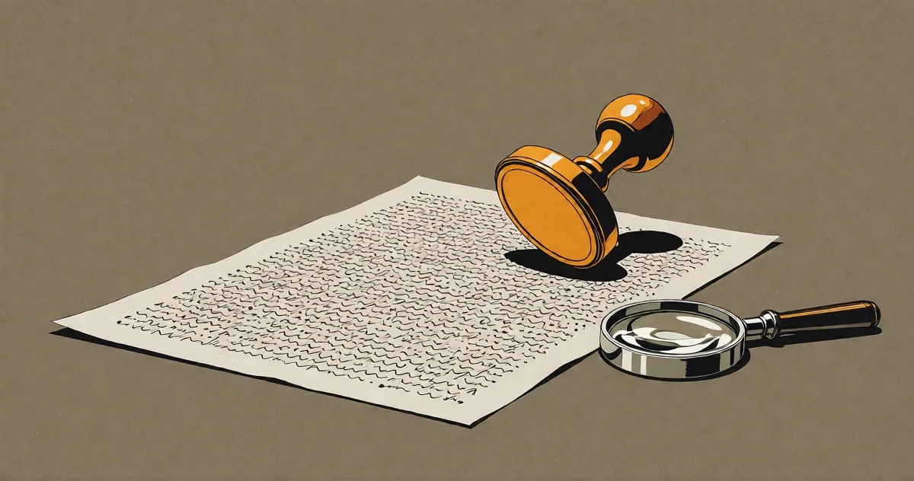

# KI macht Fehler

<!-- mb:block preset=byline -->
*by David A. Renelt (Human) and DeepSeek (AI)*

Veröffentlicht am 31. Juli 2026
<!-- mb:/block -->

<!-- mb:block preset=image:hero kind=image -->

<!-- mb:/block -->

Alle starren auf die Fehler. „KI macht Fehler“ – wahr, und fast vollkommen uninteressant. Menschen machen schließlich auch Fehler. Die interessante Frage war nie, ob das Werkzeug irrt. Sondern was die Irrtümer offenbaren.

Was sie offenbaren, hat nichts mit dem Werkzeug zu tun. Es geht um uns – um ein Rahmenwerk, auf das wir uns seit Jahrhunderten verlassen und das leise an seine Grenze stößt.

---

## Das Rahmenwerk

Unser gesamter Begriff von Verantwortung ruht auf einer einzigen Annahme: Wer unterschreibt, kann die Arbeit im Prinzip eigenständig prüfen.

Man tippt Zahlen in einen Taschenrechner; das Ergebnis ist das eigene. Das Finanzamt verklagt nicht Casio. Man übergibt die Steuererklärung einem Steuerberater; das Finanzamt hält trotzdem einen selbst verantwortlich – Vorbereiter-Strafen gibt es zwar, aber sie sind eng gefasst, und guter Glaube schützt vor Strafe. Man lädt ein Vertragstemplate herunter, das man nicht vollständig durchdringt; man verwendet es trotzdem, weil es selbst aufzusetzen noch schlechter wäre – und wenn es wirklich darauf ankommt, bezahlt man eben einen Anwalt, um die Lücke zu schließen.

Das System funktionierte, weil die Kluft zwischen dem, was wir nutzen, und dem, was wir im Prinzip prüfen *könnten*, klein genug blieb, um so zu tun, als gäbe es sie gar nicht.

---

## Die Reibung

Die ersten KI-Gerichtsverfahren sahen aus, als würde das alte Rahmenwerk noch greifen. Anwälte wurden mit Ordnungsgeldern belegt, weil sie Schriftsätze mit von ChatGPT erfundenen Präzedenzfällen eingereicht hatten (*Mata v. Avianca*). Eine Fluggesellschaft wurde zur Kasse gebeten, weil ihr Kundenservice-Chatbot eigenmächtig eine Erstattungsrichtlinie für Trauerflüge erfunden hatte (*Moffatt v. Air Canada*). Doch das waren die banalen Fälle – Fälle, in denen eine Überprüfung noch möglich gewesen wäre. Die Anwälte hätten das Aktenzeichen nachschlagen können; die Airline hätte den Bot an die Leine nehmen können. Das alte Modell, das schlampige Anwender abstraft. 

Die wirklich aufschlussreichen Fälle sind jene, in denen eine Überprüfung *prinzipiell unmöglich* ist.

Der *EU Cyber Resilience Act* etwa nimmt Hersteller für Schwachstellen in ihren Open-Source-Abhängigkeiten in die Haftung – Millionen Zeilen Fremdcode, die niemand im Unternehmen je geschrieben hat oder jemals lückenlos auditieren könnte.

Im Jahr 2018 erteilte die US-amerikanische FDA die erste Zulassung für ein autonomes KI-Diagnosesystem: *IDx-DR* analysiert Netzhautbilder und erkennt diabetische Retinopathie völlig ohne Arzt in der Schleife. Nicht aus Nachlässigkeit – mit voller Absicht. Die Zulassungsbehörde schuf eigens eine neue Gerätekategorie dafür und akzeptierte formal ein System ohne jede menschliche Gegenzeichnung, weil es die ärztliche Nachprüfung in der Trefferquote schlicht übertraf.

Und es reicht noch weiter. Ein Augenarzt sieht im Auge bestimmte Spuren: Schäden durch Bluthochdruck, durch Diabetes. Aber kein Mensch der Welt kann in eine Netzhaut blicken und daraus das Alter auf drei Jahre genau ablesen, das biologische Geschlecht mit an Sicherheit grenzender Wahrscheinlichkeit, ob die Person raucht, oder ihr Fünf-Jahres-Risiko für einen Herzinfarkt. Ein neuronales Netz liest all das aus genau derselben Fotografie. 

Das erzeugt eine Zwickmühle ohne Ausweg: Der Arzt, der das Ergebnis gegenzeichnet, verifiziert gar nichts – er vollzieht ein Theater. Und der Arzt, der das Modell überstimmt, verwirft ein statistisch überlegenes Urteil zugunsten seiner Intuition. Rechtswissenschaftler – allen voran das *American Law Institute* in seiner Reform des Behandlungsstandards von 2024 – argumentieren bereits, dass genau diese Verweigerung selbst einen Behandlungsfehler darstellen könnte. Das Versäumnis, hochleistungsfähige KI *einzusetzen*, wird in den Standard der Sorgfaltspflicht als Pflichtverletzung hineingelesen. Das alte Rahmenwerk hat begonnen, seine eigene Grundannahme anzuklagen.

Meine eigene Laufbahn ist die Miniaturfassung davon. Ich habe dreißig Jahre lang Software ausgeliefert, und manches davon habe ich nie vollkommen verstanden. Das ist kein Geständnis, sondern der ehrliche Normalzustand des Handwerks. Einmal lieferte ich eine Bibliothek für Multi-Touch-Gesten aus, die ich selbst im Leben nicht hätte schreiben können. Sie funktionierte; darum ging sie an den Kunden. Und wenn doch etwas brach – Dinge brechen immer –, konnte niemand sagen, wessen Fehler es war: meiner oder der der Bibliothek. Oft wusste ich es selbst nicht. Rechtlich spielte das keine Rolle: Es war so oder so „mein Fehler“, und „mein Fehler“ ist eine wunderbar bequeme Fiktion. Die Unterschrift schluckt alles in ein und dasselbe Urteil. Die Unterscheidung zwischen „Ich habe einen Fehler gemacht“ und „Ich habe mich auf etwas verlassen, das ich nicht prüfen konnte“ bleibt unsichtbar – für das Gesetz und meistens auch für den, der unterschreibt. 

Das Theater hat nicht mit KI begonnen. KI hat es nur unmöglich gemacht, es nicht zu bemerken.

---

## Wo es versagt

Ein System, das unser Handeln auf das deckelt, was wir persönlich überprüfen können, hat genau drei mögliche Zukünfte:

1. **Die Begrenzung akzeptieren.** Den Einsatz strikt auf das beschränken, was Menschen verifizieren können. Der Markt wird das niemals mitmachen. Fähigkeiten, die existieren, werden genutzt – die einzige Frage ist, ob im Hellen oder im Verborgenen.
2. **Die Begrenzung stillschweigend übertreten.** Verantwortung wird zur Farce: Unterschriften unter Arbeiten, die niemand geprüft hat; Haftung zugewiesen an denjenigen, der dem Trümmerfeld zufällig am nächsten steht. Das ist bereits der Standard.
3. **Etwas Neues bauen.** Verantwortung ohne individuelle Verifikation.

Die Frage – können wir es uns leisten, unsere Fähigkeiten durch unser eigenes Kontrollvermögen zu begrenzen? – wirkt ungelöst. Die Geschichte zeigt: Sie ist es nicht. Die Menschheit stand vor dieser Frage schon mehrfach im zivilisatorischen Maßstab und hat jedes Mal dieselbe Antwort gegeben: Nein. Der funktionale Betrieb siegt. Die eigentliche Frage lautet nur, welche Art von Unverantwortlichkeit wir wählen. Und wir haben dafür in der Vergangenheit zwei grundverschiedene Modelle gebaut.

---

## Zweimal gebaut

**Die Politik.** Gesetzgeber treffen Entscheidungen mit Konsequenzen, die tödlicher sind als jeder Softwarefehler. Ein schlecht konstruiertes Verkehrsgesetz hat mehr Menschen das Leben gekostet als jede Sicherheitslücke in der Geschichte der Informatik. Und dennoch drohen den Verantwortlichen praktisch keine juristischen Konsequenzen, wenn es schiefgeht. Teils, weil wir aufgehört haben hinzusehen: Niemand rechnet die Verkehrstoten dem Gesetzestext zu; es gilt als Rauschen. Teils durch Rotation: Bis man die Auswirkung messen könnte, sind die Entscheider längst aus dem Amt. Und teils aus blanker Notwendigkeit: Wenn Gesetzgebung mit persönlicher Haftung verknüpft wäre, würde niemand je ein Gesetz ändern. Wir säßen fest mit den Regeln von damals, als es das letzte Mal sicher schien, welche zu erlassen. Also traf die Zivilisation eine Wahl: Immunität für die Urheber, der Schaden wird als statistisches Grundrauschen geschluckt, die Korrektur erfolgt träge über Wahlen und Skandale. Eine Million Verkehrstote pro Jahr sind eine Statistik; ein einziger Toter durch ein autonomes Fahrzeug ist ein Skandal.

**Das Internet** ist exakt derselbe Gesellschaftsvertrag, bewusst geschlossen. *Section 230* in den USA: Plattformen haften nicht für das, was ihre Nutzer veröffentlichen. Kein gesetzgeberisches Versehen, sondern ein klarer Entschluss. Denn eine Pflicht zur Vorabprüfung aller menschlichen Äußerungen hätte die demokratisierende Wucht des Netzes im Keim erstickt. Die Kollateralschäden sind real, und wir akzeptieren sie, weil die Fähigkeit *verteilt* ist: Unverifizierbarer Betrieb ist immer auch unkontrollierbarer Betrieb. Politiker versuchen bis heute, den Flaschengeist zurück ins Glas zu zwingen, und scheitern verlässlich daran – denn selbst wenn jede Plattform der Erde eine Information unterdrückt, existiert sie irgendwo weiter, abrufbar für jeden. Zum ersten Mal in der Geschichte kann Macht Information nicht mehr an zentralen Hebeln kontrollieren. Wir haben entschieden, dass diese Freiheit den Preis des Lärms wert war. Ich glaube nach wie vor, dass das richtig war.

**Die Luftfahrt.** Das andere Modell – und es wurde mit voller Absicht konstruiert. Im Jahr 1974 raste *TWA Flug 514* in einen Berghang in Virginia, weil Cockpit und Flugsicherung völlig unterschiedliche Bedeutungen mit dem Funkspruch „freigegeben für den Anflug“ verbanden. Bei den Ermittlungen stellte sich heraus: Sechs Wochen zuvor war eine andere Maschine an derselben Stelle nur um Haaresbreite einer Katastrophe entgangen. Dieser Vorfall war nie gemeldet worden. Eine Meldung hätte damals Strafe und Lizenzentzug bedeutet. Zweiundneunzig Menschen starben aus Mangel an einer Information, die das System bereits besaß.

Die Antwort darauf war nicht härtere Bestrafung, sondern bessere Infrastruktur: das *Aviation Safety Reporting System* (ASRS), das seit 1976 von der NASA als unabhängiger dritter Instanz betrieben wird. Piloten und Lotsen melden dort ihre eigenen Fehler vertraulich und genießen weitgehenden Schutz vor Sanktionen. Das internationale Luftfahrtrecht folgt exakt derselben Prämisse: *ICAO Annex 13* legt fest, dass Flugunfalluntersuchungen ausschließlich der Verhütung künftiger Unfälle dienen, niemals der Zuweisung von Schuld. Immunität – aber erkauft mit lückenloser, schonungsloser Transparenz. Jeder Flug aufgezeichnet, jeder Zwischenfall gemeldet, jeder Beinahe-Crash seziert. Das Ergebnis ist das sicherste komplexe System, das die Menschheit je betrieben hat. Und es entstand auf den Trümmern der *Comet*-Passagierjets, die in den 1950er-Jahren wegen einer damals völlig unverstandenen Materialermüdung aus der Luft fielen. Man kann keine sicheren Flugzeuge bauen, ohne zuvor unsichere geflogen zu sein. Die Praxis ist die Rückkopplungsschleife.

Beide Modelle akzeptieren, was unser gegenwärtiges Haftungsrecht leugnet: Die individuelle Unterschrift taugt nicht mehr als Schutzschild. An ihre Stelle tritt entweder statistische Toleranz oder systemisches Lernen.

---

## Intelligenz hat keinen Crashtest

Welches dieser beiden Modelle für KI gelten wird, ist keine offene Verhandlungsmasse. Es wird durch die Architektur der Technologie diktiert.

Das Luftfahrtmodell verlangt zwei Dinge: einen geschlossenen, genau definierten Kreis von Betreibern, an die man Meldepflichten binden kann, und eine *klar umgrenzte Aufgabe*, die man messbar sicher machen kann. „Fliegen“ ist eine umgrenzte Aufgabe. Man kann sie crashtesten, vermessen, aus jedem Fehler lernen. Man sehe sich autonome Fahrzeuge an: eine Handvoll Betreiber, eine einzige Funktion, Sicherheit gemessen in Unfällen pro gefahrener Million Meilen gegen den menschlichen Referenzwert. Hier entsteht das Luftfahrtmodell vor unseren Augen. Dasselbe in der Medizin: *IDx-DR* konnte zugelassen werden, weil es genau eine einzige Krankheit diagnostiziert.

Nun versuche man dasselbe mit einem universellen KI-Modell. Sicher wofür? Intelligenz an sich ist weder sicher noch unsicher; erst das, was man damit anstellt, ist es. Es gibt keinen Crashtest für die universelle Fähigkeit zu allem. Das Einzige, was man regulieren könnte, ist die Nutzung – und die Nutzung ist vollkommen offen: jeder Mensch, überall, für alles. Das ist die Gestalt des Internets, nicht die der Luftfahrt. Und offene Systeme erhalten unweigerlich den Gesellschaftsvertrag des Internets: Immunität, Rauschen und die Unmöglichkeit zentraler Vorabkontrolle.

Die Landkarte ist daher bestechend einfach:
Wo KI ein abgegrenztes **Gerät** ist, wird sie wie die **Luftfahrt** reguliert.
Wo KI universelle **Intelligenz** ist, wird sie wie das **Internet** behandelt werden.

Nicht weil ein Gremium das so beschlossen hätte – sondern weil sich kein anderes Modell an die jeweilige Beschaffenheit anheften lässt.

**Die Fehler waren nie das Problem. Das Rahmenwerk war es.** Es lässt sich nicht dadurch kitten, dass man von Menschen verlangt, genau jene Vorgänge eigenhändig zu prüfen, für die sie Maschinen geholt haben, weil sie es selbst nicht konnten. Bei den Geräten können wir das neue System noch bewusst gestalten. Bei der Intelligenz hat die Realität die Wahl längst für uns getroffen – und die einzige Wahl, die uns bleibt, ist, ob wir ihr nüchtern ins Gesicht sehen oder nach schöneren Worten für die Kapitulation suchen.

---

*Dieser Post wurde mit KI entworfen, und seine Argumente wurden von einem Menschen geprüft – das alte Rahmenwerk, solange es noch hält.*

**Quellen:** Mata v. Avianca, Inc., No. 22-cv-1461 (S.D.N.Y. 2023) · Moffatt v. Air Canada, 2024 BCCRT 149 · EU Cyber Resilience Act, Verordnung (EU) 2024/2847 · FDA De Novo Autorisierung von IDx-DR (2018) · Poplin et al., Nature Biomedical Engineering (2018) · Communications Decency Act § 230 · ALI Standard-of-Care Revision (2024) · NASA Aviation Safety Reporting System (est. 1976) · ICAO Annex 13