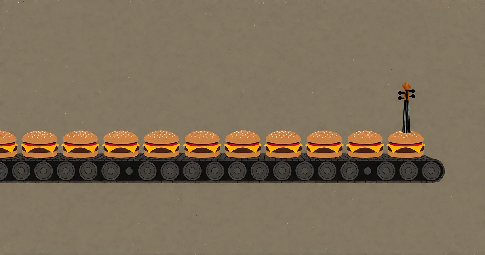

# KI-Müll ist nicht das Fast Food der Musik. Genre-Musik ist es.

<!-- mb:block preset=byline -->
*by David A. Renelt (Human) and DeepSeek (AI)*

Veröffentlicht am 30. Juli 2026
<!-- mb:/block -->

<!-- mb:block preset=image:hero kind=image -->

<!-- mb:/block -->

Mein Sohn nennt fast jedes Stück, das sich brav an die Spielregeln seines Genres hält – Pop, EDM, Funk –, abfällig „KI-Slop“. Er meint es als Beleidigung. Die Analogie liegt auf der Hand: KI-Musik ist wie Fast Food. Billig, massenproduziert, nährwertfrei.

Er irrt sich. Aber nicht so, wie man denkt.

---

## Die Korrektur

Genre-konforme Musik war *schon immer* Fast Food. Lange bevor eine KI auch nur eine einzige Note berechnen konnte. Ein perfekt gebauter Radio-Popsong, ein nach Schema F produzierter EDM-Drop, ein Funk-Track, der jede erwartete Zählzeit bedient – das alles sind Cheeseburger. Sie erfüllen ein klares Bedürfnis, zuverlässig und ohne Aufhebens. Man weiß vorher genau, was man bekommt. Genau das *ist der Sinn*.

Was sich geändert hat, ist nicht das Produkt. Was sich geändert hat, ist, wer es herstellt.

KI ist im Zubereiten von Fast Food schlicht unschlagbar. Sie ist darin *besser* als die meisten Menschen. Ein Musikproduzent mit tiefem Gespür für den Zeitgeist kann etwas zimmern, das passt. Eine KI kann dasselbe schneller, ohne gekränktes Ego und mit enzyklopädischem Zugriff auf jeden jemals funktionierenden Produktionstrick des Genres. Sie langweilt sich nicht. Sie will sich nicht profilieren. Sie liefert einfach.

Wer im Geschäft der Genre-Musik arbeitet, für den ist KI kein ferner Ersatz. Sie ist die direkte Konkurrenz. Und sie gewinnt über Masse, Tempo und Verlässlichkeit.

---

## Warum die Maschine im Bauch der Kurve siegt

Das ist kein Kreativitätsproblem. Es ist ein statistisches Verteilungsproblem.

Modelle werden auf bestehenden Daten trainiert. Sie lernen die zentrale Tendenz – die Konventionen, die Muster, dort, wo die Daten sich ballen. Diese Ballung sitzt im Bauch der Glockenkurve, wo die allermeiste Musik lebt. KI ist phänomenal darin, Dinge zu erzeugen, die genau dorthin gehören. Sie schließt Muster ab. Sie setzt die statistisch erwartbare nächste Note, den vertrauten Akkordwechsel, den ausgewogenen Mix.

Die meisten Menschen *wollen* diesen Bauch. Sie wollen Musik, die vertraut klingt. Sie wollen wissen, was als Nächstes kommt. Die Popularität von Genre-Musik ist kein Geschmacksversagen – sie ist ein funktionaler Erfolg. Musik, die sich verlässlich auf den Schienen bewegt, liefert exakt das, wofür der Hörer da ist. Wohlfühlkost. Ein Cheeseburger.

KI brät hervorragende Cheeseburger.

---

## Wo der Mensch noch kocht

Die interessante Frage lautet: Was ist die eigentliche *Küche* der Musik?

Technisch gesehen: alles, was ein Wagnis eingeht. Es passiert in jedem Genre an den Rändern dessen, was die Form gerade noch toleriert: Eine Produktionsentscheidung, die für das Genre eigentlich falsch ist, aber trotzdem zündet. Eine Harmonie, die sich nicht auflösen dürfte, es aber dennoch tut. Eine Struktur, die den Pakt mit dem Hörer fast bricht – und ihn im allerletzten Moment doch noch einlöst.

Ich nenne das das „angrenzend Unbekannte“. Es ist der eine Schritt über das Erwartete hinaus – nicht so weit, dass man den Hörer verliert, aber weit genug, um ihn aufhorchen zu lassen. Der Unterschied zwischen einem gewöhnlichen Cheeseburger und einem Gericht, das vertraut schmeckt, aber keines ist.

Darin ist die KI schlecht. Nicht weil ihr Fantasie fehlte, sondern weil das angrenzend Unbekannte kein ableitbares Muster ist. Es ist das gezielte Abweichen vom Muster, das dennoch trifft. Es verlangt das Gespür dafür, was der Hörer *fast* erwartet – um es ihm dann nicht ganz so zu geben. Trainingsdaten lehren, wo das Zentrum liegt. Sie lehren nicht, wo die Kante verläuft.

---

## Die Kunst des Schmuggels

Wer als Musiker ein Publikum sucht, steht vor einem Widerspruch: Der Markt verlangt Cheeseburger. Der Musiker will kochen.

Die Lösung besteht nicht darin, sich für das eine oder das andere zu entscheiden. Die Lösung heißt: *schmuggeln*.

Man liefert dem Markt, was er verlangt – die vertraute Hülle, den erwarteten Rhythmus, den Komfort des Genres. Und dann steckt man eine Zutat auf die Ladefläche, mit der niemand gerechnet hat. Ein winziges Abenteuer. Ein Moment, in dem das Stück fast woandershin abbiegt. Man serviert ihnen den Cheeseburger, aber die Sauce hat eine Note, die sie nicht benennen können.

Das haben große Musiker schon immer getan. Die legendären Pop-Produzenten erfinden die Form nicht neu – sie beherrschen sie so meisterhaft, dass man den einen Takt, in dem sie die Regel brechen, kaum bemerkt.

KI wird noch sehr lange schlecht im Schmuggeln sein. Schmuggeln setzt voraus, zu wissen, welche Regeln man bricht – *und* zu wissen, dass ihr Bruch ein bewusster Akt der Übertretung gegen eine Form ist, die man souverän beherrscht. Eine KI weiß nicht, dass sie Regeln bricht. Sie weiß nicht einmal, dass es Regeln gibt.

---

## Die Kante von heute, das Klischee von morgen

Und dann gibt es jene Musik, die im Augenblick fast niemand will.

Die Rebellen. Die Quertreiber. Die Experimente in feuchten Kellern, die für niemanden Sinn ergeben – außer für Musiker, Produzenten und eine Handvoll Verrückte, die nach Neuem hungern. Diese Musik hat kein Publikum. Sie scheitert fast jedes Mal. Wenn sie gelingt, klingt sie zunächst gar nicht wie Musik: Sie klingt wie Lärm, der vielleicht eines Tages, mit ausreichend Feinschliff, zu einem Genre werden könnte.

Darin ist KI *katastrophal*. Für die unkartierte Kante gibt es per Definition keine Trainingsdaten. Die Kante wurde noch nicht aufgenommen, nicht analysiert und in keine Playlist sortiert. Sie entsteht heute Nacht in einem Keller in Berlin. In sechs Jahren läuft sie in einem Autowerbespot. Und in zwölf Jahren kann eine KI sie fehlerfrei produzieren.

Die Quertreiber sind die Saatgutbank. Dubstep war solche Musik. Industrial war solche Musik. Auto-Tune als bewusster Effekt statt als Korrekturhilfe war ein solcher Zug. Jede Genre-Konvention, die eine KI heute perfekt reproduziert, war einmal ein Akt der Rebellion gegen vorherige Konventionen.

Der Kreislauf läuft immer gleich: Menschen erkunden die Kante → die Kante erstarrt zum Genre → das Genre wird populär → KI lernt das Genre → KI macht die besseren Cheeseburger als Menschen.

KI ist nicht der Feind des musikalischen Fortschritts. KI ist die hocheffiziente Fabrik für das, was Menschen vor zehn Jahren erfunden haben.

---

## Warum wir den Menschen brauchen

Wir brauchen Menschen, weil irgendjemand die Klischees von morgen erfinden muss.

Wir brauchen Musiker, die jahrelang Musik machen, die kaum jemand hört, um jene winzigen Bruchstellen in der Form zu finden, an denen Neues wachsen kann. Wir brauchen Produzenten, die den Zeitgeist gut genug verstehen, um das angrenzend Unbekannte in das Vertraute zu schmuggeln. Und wir brauchen die Rebellen, deren Versuche neunundneunzigmal scheitern und einmal gelingen – und dieser eine Erfolg wird das Trainingsmaterial für die nächste Generation der Systeme.

Die KI kann die Cheeseburger braten. Das ist völlig in Ordnung – die meisten Menschen wollen Cheeseburger, und Maschinen machen sie besser, als wir es je konnten.

**Aber irgendjemand muss den Cheeseburger zuerst erfinden.**
