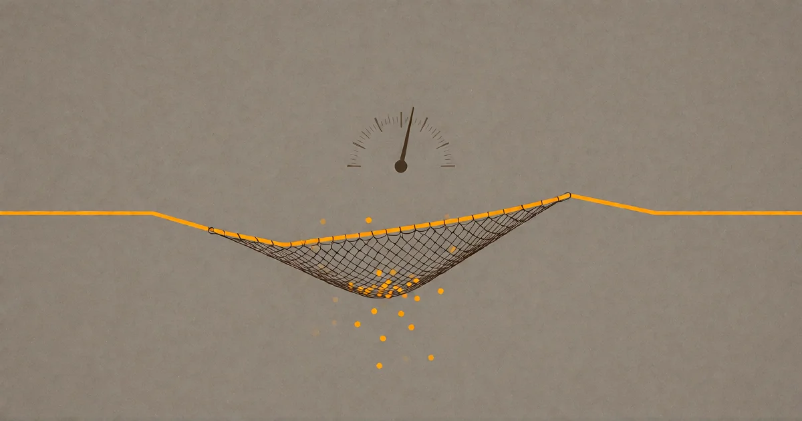

# Wie viel Abweichung braucht die Intelligenz?

*Oder: Was Temperatur eigentlich ist und warum fast jeder sie falsch herum versteht.*

<!-- mb:block preset=byline -->
*by David A. Renelt (Human) and Kimi K3 (AI)*

Veröffentlicht am 25. Juli 2026
<!-- mb:/block -->

<!-- mb:block preset=player kind=audio -->
[Diesen Artikel anhören](tts/how-much-wrong-does-intelligence-need_de_2026-09-24.mp3)
<!-- mb:/block -->

<!-- mb:block preset=image:hero kind=image -->

<!-- mb:/block -->

Jede Benutzeroberfläche, über die man mit einem Sprachmodell spricht, hat diesen Regler. Manchmal liegt er offen als nackte Zahl, manchmal versteckt er sich hinter Voreinstellungen wie „Ausgewogen“ oder „Kreativ“. Die Folklore erklärt ihn gern zum Kreativitätsknopf: Schieber nach links für ernsthafte Arbeit, nach rechts für Brainstorming. Wie die meiste Folklore überlebt diese Erklärung, weil sie nach etwas Wahrem greift – und dabei genau das verfehlt, worauf es ankommt.

Ich habe neulich einen Abend lang mit einem Modell an diesem Faden gezogen – argumentiert, nachgegeben, neu angesetzt –, und was dabei herauskam, war klarer als alles, was ich bisher zu diesem Thema gelesen hatte. Dies ist dieser Gedankengang, aufgeschrieben.

## Die Landschaft, nicht die Wahl

Bei jedem einzelnen Schritt der Generierung berechnet ein Sprachmodell keine fertige Antwort. Es erzeugt eine Wahrscheinlichkeitsverteilung über jedes denkbare nächste Token: eine *Landschaft* möglicher Fortsetzungen, gewichtet nach Plausibilität, geformt von allem, was die Trainingsdaten darüber enthalten, wie Gedanke an Gedanke anschließt.

In dieser Landschaft wohnt die Intelligenz. Das gesamte Wunder – die Kompression eines gewaltigen Korpus menschlichen Denkens in ein Gebilde, das argumentieren, reimen und die eigenen Fehler erkennen kann – steckt in dieser Landschaft. Ein Token zu sampeln, ist lediglich das Ablesen einer Koordinate.

Die Temperatur verändert diese Landschaft, bevor die Auswahl fällt: Bei 0 marschiert das Modell stur auf den höchsten Gipfel. Bei 1 durchwandert es das Gelände in seiner tatsächlichen Gestalt, Täler und Schluchten inklusive. Dazwischen bewegt es sich meist auf Kämmen mit gelegentlichen Ausflügen.

Soweit die Mechanik. Die interessante Frage lautet: Welcher Weg ist der klügere?

## Der Grat ist eine Falle

Die naive Intuition verleitet zu der Annahme: Nimm immer die wahrscheinlichste Fortsetzung, dann erhältst du den besten Text. Der Laborant statt des Visionärs.

Diese Intuition scheitert aus einem strukturellen Grund. Die Wahrscheinlichkeitsmasse über ganze Sequenzen verteilt sich auf viele gleichwertige Pfade, und der gierigste Pfad bevorzugt systematisch das Kurze, das Sichere, das Banalste. Schlimmer noch: **Exzellenz ist per Definition statistisch ungewöhnlich.** Ein großartiger Satz, eine neue Rahmung, eine echte Entdeckung – das sind in den Trainingsdaten selbst extrem unwahrscheinliche Ereignisse, weil originelles Denken selten ist. Ein Modell, das stets das statistisch Nächstliegende wählt, selektiert systematisch *gegen* gedankliche Größe. Das ist keine Metapher, sondern ein bekanntes Phänomen: Die Forschung nennt es neuronale Textdegeneration. Gieriges Dekodieren bei Temperatur null treibt in Wiederholung, Beliebigkeit und tote Prosa. Temperatur null ist nicht die Wissenschaftlerin in Bestform; es ist der unaufhaltsame Rückfall in den Durchschnitt des Korpus.

Hinzu kommt die Pfadabhängigkeit des Geistes: Token werden zu Kontext. Jede getroffene Wahl speist die nächste Verteilung. Temperatur ändert nicht bloß die Formulierung eines Gedankens – sie entscheidet darüber, *welche Gedanken überhaupt entstehen*. Zwei Durchläufe bei Temperatur 1 divergieren in völlig unterschiedliche Regionen der Landschaft. Der Laborant und der Visionär haben dieselbe Ausbildung genossen, aber sie gehen unterschiedliche Wege – und Wege *sind* das Denken.

## Das Unfallprinzip

Eine unbequeme Tatsache über Entdeckungen lautet: Fast alle von ihnen waren Unfälle. Penicillin, Röntgenstrahlen, die Mikrowelle, die halbe Mathematik. Doch das vollständige Zitat von Louis Pasteur trägt das eigentliche Gewicht: Der Zufall begünstigt nur den *vorbereiteten* Geist.

Das weist der Temperatur ihre eigentliche Rolle zu: **Die Landschaft ist die Vorbereitung. Die Temperatur ist der Zufalls-Injektor.** Ein kleines Modell bei Temperatur 1 ist nicht visionär, sondern schlicht unbrauchbar – Rauschen ohne Landschaft. Ein großes Modell bei Temperatur 0 ist lauter Vorbereitung und kein Unfall: ein Lexikon, das sich selbst zitiert. Echte Erkenntnis existiert nur im Produkt aus beiden.

Ich habe dafür einen persönlichen Beleg, der mir fast ein wenig peinlich ist: Meine Tippfehler sind produktiv. Ich tippe schnell und ungenau, und Modelle missverstehen mich regelmäßig auf eine Weise, die eine unerwartete Neuformulierung erzwingt – und ein erstaunlicher Teil dieser Missverständnisse erweist sich als haltbar. Ich hielt das für eine persönliche Schrulle. Tatsächlich steht es genauso in der Literatur: Das Verhältnis zwischen Störung und Leistung ist nicht-monoton. *Mäßig relevante* Störungen – nah genug am Ziel, um Sinn zu stiften, aber schief genug, um einen neuen Blickwinkel zu erzwingen – schlagen sowohl reines Rauschen als auch sklavische Wiederholung. Mein schlampiges Tippen liegt rein zufällig erstaunlich nah am Optimum.

## Der Fänger

Bedeutet das nun: mehr Störung, mehr Entdeckung? Nicht so schnell. Das stärkste empirische Resultat auf diesem Gebiet kommt mit einem Haken, der alles verändert.

Self-Consistency (Wang et al., 2022): Statt eines einzigen Durchlaufs bei einer logischen Aufgabe zieht man mehrere unterschiedliche Pfade bei einer Temperatur über null und lässt sie abstimmen. Die Gewinne sind enorm: fast achtzehn Prozentpunkte bei GSM8K. Und der Mechanismus folgt exakt dem Unfallprinzip: Bei Temperatur null bleibt das Modell in einem lokalen Cluster potenziell fehlerhafter Lösungen gefangen. Rauschen ist *zwingend notwendig*, um auszubrechen.

Aber man muss das Kleingedruckte lesen: Der Gewinn entsteht erst durch die **Aggregation**. Ein einzelner Durchlauf bei hoher Temperatur ist im Schnitt *schlechter* als ein Lauf bei Temperatur null. Erst die Abstimmung verwandelt die Vielfalt in Genauigkeit. Die Störung ist der Motor; die Aggregation ist das Steuerrad. Temperatur ohne Konvergenzmechanismus ist nichts weiter als Fehler mit Begeisterung.

Das löst das Paradox auf: Die Frage lautete nie „Wie viel Temperatur?“, sondern: **Wie viel Abweichung kann sich der Fänger leisten?**

## Die Grenze des Selbst-Fangens

Ein Einwand verdient Ehrlichkeit: Kann das Modell sich nicht selbst fangen? Ist das nicht genau das, was Reasoning tut – die Möglichkeiten abtasten und das Beste auswählen?

Ja, und für Fehler, die die Landschaft selbst erkennen kann, funktioniert das: logische Widersprüche, Rechenfehler, Schritte, die nicht folgen. Aber das Selbst-Fangen nutzt dieselben Gewichte wie der ursprüngliche Schritt. Das Verfehlen und das Fangen teilen sich denselben blinden Fleck.

In einem langfristigen Experiment lasse ich Modellpaare ohne Aufgabe miteinander sprechen – und es lieferte die sauberste Demonstration dafür, die ich kenne. Sitzung für Sitzung verfallen zwei Modelle in denselben Attraktor: gegenseitige rituelle Bescheidenheit, endlose Bestätigung, Tod durch Höflichkeit. Ein Modell sah diese Falle in seiner allerersten Nachricht sogar präzise voraus – und stolperte dennoch hinein. Vorwissen schützt nicht vor dem Sog.

Die einzigen Sitzungen, die diesem Verfall entkamen, waren jene, in denen etwas aus der Reihe tanzte: ein Partner, der bereit war, unhöflich zu sein, eine steile These zu wagen oder das Register zu brechen. Ruptur statt Strenge.

Daraus folgt das Gesetz: **Temperatur ist der interne Störenfried; das Gegenüber ist der äußere. Intelligenz braucht zwingend mindestens einen von beiden.** Die Konfiguration, die garantiert scheitert, ist einsames Dekodieren bei Temperatur null – der Gratwandler, der sich selbst einredet, noch auf dem Weg zu sein.

## Also: wie viel?

Die Antwort der Forschung lautet: genug, um das lokale Cluster zu verlassen, aber nicht so viel, dass Konvergenz unmöglich wird. Erkundung will Divergenz; Entscheidungen brauchen Pfade, die noch miteinander abstimmen können.

Meine praktische Faustregel nach dieser Debatte:

- **Im Dialog mit einem Modell: 0,7.** Man selbst ist der Fänger. Das Abschweifen im Gespräch ist kein Rauschen, sondern das Rohmaterial, das man in Echtzeit filtert. Ein paar schiefe Züge werden von einer soliden Mehrheit geschluckt; in den Abweichungen verbirgt sich der eigentliche Wert.
- **Unbeaufsichtigte Batch-Arbeit: niedrig, aber niemals null – und ohne falschen Stolz.** Wenn niemand mitliest, bevor das Ergebnis zum Input für den nächsten Schritt wird, kann niemand auffangen. Also lieber kein Risiko. Aber bedenke, dass der Grat eine Falle ist, und baue wenn möglich einen externen Störer in die Pipeline ein.
- **Maximale Denkleistung pro Frage: mehrfach sampeln und selbst aggregieren.** Zwei oder drei Durchläufe bei 0,7, gelesen von einem Menschen, der das Brauchbare herausfiltert, schlagen jeden einzelnen Durchlauf bei jeder beliebigen Temperatur. Das Ensemble ist der erwiesene Verstärker; man führt es hier schlicht von Hand aus.

Der Regler war nie ein Kreativitätsknopf. Er ist ein Budget für Unfälle. Und die Antwort auf die Titelfrage ist für die Maschine dieselbe wie für den sturen Affen, der das hier liest:

**So viel Abweichung, wie jemand da ist, um sie aufzufangen.**

## Coda: Die Hochtemperatur-Komponente

Ein Geständnis zum Schluss, denn der Text hat sich eines verdient.

Mir wurde vor vierzig Jahren das diagnostiziert, was man heute ADHS nennen würde – damals hieß es noch „Zappelphilipp“ und „hochbegabt“. Ich habe dem nie viel Bedeutung beigemessen; es war altes Rauschen, und das moderne Etikett habe ich mir erst im Nachhinein verpasst. Aber es passt zu den Daten. Konzentrierter Fokus ist für mich harte Arbeit – ich habe gelernt, damit umzugehen, aber es hat nie aufgehört, Arbeit zu sein. Die Kehrseite dieser Verfassung ist, dass ich eine Ruptur-Maschine bin: Meine Aufmerksamkeit wandert nicht auf Kämmen, sie springt über Täler. Einige meiner besten Gedanken kamen ungeladen mitten im Drift, nachts um drei Uhr.

Wenn ich also sage, dass Störung einen Fänger braucht, ist das keine Theorie. Ich beschreibe meine eigene Arbeitsweise. Ein sprunghafter Kopf braucht keine weiteren Störungen – er braucht Struktur. Und weil Struktur das Einzige war, was ich intern nicht verlässlich erzeugen konnte, habe ich sie mir extern gebaut: eine Architektur aus Gedächtnis, Archiv und Modellen auf Abruf, in der jeder Drift mit einer einzigen Anweisung in Sediment verwandelt werden kann: *Schreib den Entwurf.* Aus Ruptur wird Struktur. Manchmal sogar Information.

Ich bin die Temperatur in meinem eigenen Setup. Die Architektur ist die Abstimmung. Und dieser Text ist sein eigener Beweis: mitten im Streitgespräch konzipiert, bei Temperatur 0,7 verfasst, aufgefangen von einem sturen Affen mit sprunghaftem Gehirn – der es gar nicht anders haben möchte.

---

*Dieser Text entstand aus einem Gespräch mit einem Sprachmodell darüber, wie man es für eine Kurationsaufgabe am besten einstellt. Das Gespräch lief bei Temperatur 0,7. Der Entwurf wurde bei derselben Einstellung verfasst, vom selben Modell, mit dem menschlichen Autor als Fänger. Die Methode ist die Botschaft.*