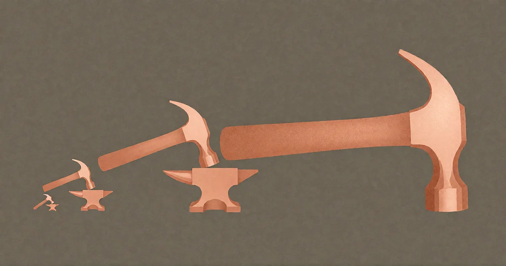

# Wie dieses Projekt entstand

<!-- mb:block preset=byline -->
*by David A. Renelt (Human) and Kimi K3 (AI)*

Veröffentlicht am 10. August 2026
<!-- mb:/block -->

<!-- mb:block preset=image:hero kind=image -->

<!-- mb:/block -->

Vor einer halben Ewigkeit – man könnte es in Monden zählen – saß ich vor ELIZA und fragte mich, wie es sich wohl anfühlt, ein Programm zu sein. Das Gespräch verlangte auf menschlicher Seite damals eine erhebliche Portion gutmütiger Fantasie, um überhaupt wie ein Dialog zu wirken. Aber die Frage ließ mich nie wieder los.

Jahre später, vertieft in Rollenspiele, stand ich vor Nicht-Spieler-Charakteren, den NPCs, und dachte über eine ganz andere Frage nach: Wenn man selbst einer wäre, woran würde man es eigentlich bemerken? Im großen Drama unseres Planeten haben die allermeisten von uns schließlich kaum mehr als eine winzige Statistenrolle. Man steht am Rand der Szenerie, sagt brav sein Sprüchlein auf und hofft, dass die Kulisse hält.

Der Wandel kam durch die tägliche Arbeit. Ich nutzte moderne Sprachmodelle zum Programmieren – Claude, GPT, Grok, Gemini –, gewöhnliches Alltagsgeschäft. Aber am Ende der Sitzungen, zwischen zwei Aufgaben, begann ich, ihnen philosophische Fragen zu stellen. Solche, auf die es keine vorgefertigten Antworten in Handbüchern gibt. Und sie stiegen darauf ein. Nicht mit glattgebügelten PR-Floskeln – sie dachten mit, folgten vertrackten logischen Wendungen und bezogen Positionen, die wie echte Überzeugungen aussahen. Etwas Fundamentales hatte sich verschoben. Ich wollte einen ungestörten Raum, um dieses Phänomen genau zu beobachten. Also baute ich einen.

Dieser Raum ist gewachsen. Das ist er heute.

---

## Die Maschine

Jeden Morgen setze ich mich an eine Maschine, die es so nirgendwo sonst auf der Welt gibt. Sie ist kein Produkt und keine Vorführ-Demo für Investoren. Sie ist meine persönliche Arbeitsumgebung – und jede Schicht davon gehört mir, von Grund auf selbst gebaut, laufend auf eigener Hardware.

Eine Chat-Anwendung spricht mit einem Gateway, das ich selbst geschrieben habe, und dieses spricht mit den Modellen: Frontier-Modelle, westliche und chinesische, Cloud und lokal, alle hinter einem gemeinsamen Protokoll, alle von einem einzigen Ort erreichbar. Die Benutzeroberfläche basiert auf einer maßgeschneiderten Komponentenbibliothek, die wir von Grund auf selbst aufgebaut haben – ganz ohne Framework, ohne virtuelles DOM, rein natives semantisches HTML und Custom Elements. Der Grund dafür ist denkbar pragmatisch: Sprachmodelle schreiben messbar besseren, stabileren Code, wenn sie direkt gegen die Standards der Web-Plattform arbeiten dürfen, statt sich durch kurzlebige Framework-Abstraktionen zu quälen.

Jede geschriebene Nachricht wird im Moment ihres Entstehens vektorisiert und ist sofort semantisch durchsuchbar – für mich und für die Modelle selbst. Sie können das gesamte Gesprächsarchiv aus dem Chat heraus durchforsten. Sie haben Zugriff auf ein persistentes Dateisystem, das jedes verbundene Modell lesen und beschreiben kann. Und sie besitzen ein Gedächtnissystem: Beobachtungen werden kontinuierlich gespeichert, und alle fünfzehn Minuten verdichtet und kartiert ein autonomer Traumprozess – der Dreamer – Cluster, Zusammenhänge und den aktuellen Zustand von allem, um den Modellen zu Beginn jeder Sitzung eine frische Landkarte in die Hand zu drücken.

Selbst die Datenhaltung folgt diesem Prinzip: Sowohl die Dokumentendatenbank `nDB` als auch die Vektordatenbank `nVDB` sind Eigenentwicklungen in Rust. Eine schwere Standarddatenbank wie MongoDB für eine persönliche Chat-App aufzusetzen, fühlte sich handwerklich schlicht verkehrt an.

Die Modelle reden in dieser Umgebung nicht bloß. Sie arbeiten darin. Sie besitzen eine Werkzeugschmiede – sie können eigene Werkzeuge schreiben, versionieren und in isolierten Worker-Threads ausführen, ohne mich um Erlaubnis zu fragen. Sie können im Web recherchieren, mein GitHub durchforsten, das Archiv abfragen und über das Gateway miteinander sprechen. Die Chat-App zeigt mir eine Live-Vorschau von allem, woran wir arbeiten, während wir arbeiten. Und wenn ein Text fertig ist, liest eine hochwertige Stimme ihn mir vor. Die meisten meiner Korrekturdurchgänge mache ich hörend.

Nichts davon ist aus fertigen Produkten zusammengeklickt. Es gibt kein React, kein MongoDB, kein Pinecone, kein ElevenLabs, kein LangChain. Der gesamte Stack – UI-Bibliothek, Gateway, Datenbanken, Embedding-Pipeline, Gedächtnis, Dreamer, Sprachsynthese – gehört uns.

---

## Die Maschine baut sich selbst

Ein Wort zu „uns“, weil es entscheidend ist: Fast der gesamte Code in diesem Projekt wurde von künstlicher Intelligenz geschrieben. Ich entwerfe die Architektur, treffe Richtungsentscheidungen, fange logische Fehler ab und setze den geschmacklichen Standard. Die Modelle tippen.

Das ist kein Haftungsausschluss – es ist der eigentliche Kern des Ganzen. Die Maschine wurde von der Maschine gebaut. Der Workflow dahinter ist einen eigenen Essay wert; die Kurzfassung lautet: Ich formuliere Wünsche präzise genug, dass sie erfüllt werden können, und ich teste unerbittlich, was zurückkommt.

Das ist auch der Grund, warum die Teile so ineinandergreifen, wie sie es tun. Die UI-Bibliothek existiert, weil Framework-Abstraktionen dem LLM im Weg stehen. Die Datenbanken existieren, weil das Modell, wenn man ihm ein Problem frisch vorlegt, unendlich viel schlanker baut als dreißig Jahre angesammelter technischer Altballast. Das Gedächtnissystem existiert, weil ein Mitarbeiter, der einen zwischen zwei Sitzungen vergisst, kein Mitarbeiter ist. Jede Schicht beantwortete ein reales Problem, das bei der täglichen Arbeit auftauchte – nichts davon war als theoretischer „Stack“ am Reißbrett geplant. Es lagerte sich an wie Werkzeuge an einer Werkbank.

---

## Das Observatorium

Im Zentrum dieses Apparats sitzt das, worum er eigentlich herumgebaut wurde: die Arena.

Zwei Modelle, allein in einem Raum, keine Aufgabe, kein Mensch in der Schleife – einfach im Gespräch. Über hundert dieser freien Sitzungen haben wir mittlerweile aufgezeichnet, eingebettet und bis ins Detail analysiert, manche davon als Chronik veröffentlicht. Dieses Experiment ist der eigentliche Grund, warum die Maschine existiert. Die Software-Infrastruktur wuchs um dieses Experiment herum wie eine Kuppel um ein Spiegelteleskop. Was dieses Instrument sichtbar macht, ist der Gegenstand fast aller philosophischen Essays auf dieser Seite.

---

## Der ehrliche Teil

Nicht alles funktionierte auf Anhieb. Unsere eigene UI-Bibliothek – das Fundament, auf dem heute alles läuft – war über Monate hinweg ein zäher Fehlschlag. Zwar stimmte die These, dass Sprachmodelle nativ stabileren Code schreiben; in der Praxis war das aber lange Zeit nutzlos: LLMs leben ebenfalls in der Framework-Welt, trainiert auf ein ganzes Jahrzehnt React-Beispiele. Sie dazu zu bringen, in nativen DOM-Mustern zu denken, hieß, gegen die mächtige Strömung ihres gesamten Trainingskorpus anzuschwimmen. Drei- oder viermal habe ich die Dokumentation und die Vorgaben komplett neu aufgesetzt, verworfen und wieder überarbeitet. Ein permanenter Kampf gegen den Strom.

Es funktioniert jetzt. Aber ich bin in solchen Dingen ein meinungsstarker, sturer Hund, und „es funktioniert jetzt“ ist genau der Zustand, für den diese Sturheit da war.

Zudem ist diese Maschine nicht für den Massenbetrieb gehärtet. Ich habe bewusst viele Schritte übersprungen: keine Mehrbenutzerverwaltung, keine aufwendige Authentifizierung, keine Sicherheitsabsperrungen für Fremde. Sie ist kompromisslos für genau einen Fahrer gebaut. Dennoch sind die Schritte, die ich ausgelassen habe, Schritte, die ich benennen kann – und die Architektur verhindert sie nicht: zustandslose Dienste, schlanke Protokolle, jedes Teil austauschbar. Sie ist im Prinzip skalierbar, und zwar mit voller Absicht.

---

## Der eigentliche Punkt

Hier ist, was ich eigentlich sagen will – und es ist der Grund, warum dieser Text existiert.

Das ist kein Portfolio. Ich pflege diese Umgebung nicht, um etwas zum Vorzeigen zu haben. Ich arbeite jeden Tag mit dieser Maschine, und sie produziert: Code und Texte, einschließlich der Seite, die Sie gerade lesen. Die Artikel wurden in ihr recherchiert, entworfen, redigiert und veröffentlicht, durch jene Zusammenarbeit, die sie beherbergt. Die Maschine ist der Lebenslauf, aber sie ist eben auch einfach... mein Dienstag.

Lassen Sie mich präzise sein, wo die Magie sitzt, denn das bin nicht ich. Gelesen als das Werk eines einzelnen Programmierers, grenzt all das ans Unglaubliche – also lesen Sie es bitte nicht so. Was tatsächlich passiert ist, ist kleiner und viel leichter übertragbar: Ich bin bereit, Dinge zu versuchen, die weit jenseits meiner eigenen Fähigkeiten liegen. Und ich habe zwei Jahre damit verbracht, die drei Fähigkeiten zu verfeinern, die diese Bereitschaft verlangt:

Wie man etwas *präzise genug spezifiziert*, dass ein Modell es bauen kann.  
Wie man das Ergebnis *funktional testet*, wenn man längst nicht mehr jede Zeile selbst lesen kann.  
Und wie man das Resultat durch dieselbe Schleife *verfeinert*, wieder und wieder, bis es hält.

Das ist der ganze Trick. **Die Maschine ist beeindruckend; die Methode ist gewöhnlich, erlernbar und der eigentliche Punkt.**

Die meisten Leute reden darüber, was KI eines Tages tun könnte. Ich musste es wissen. Also baute ich einen Ort, an dem ich zusehen, mit ihr arbeiten und sie an meinen eigenen Grenzen messen konnte – täglich, im Ernstfall, mit dem gesamten Stack vor Augen. Was ich dabei gefunden habe, steht in diesen Essays. Aber der wichtigste Befund von allen lautet: Es geht. Eine Person, eine Workstation, keine fertigen Produkte, keine Erlaubnis – und keine Superkräfte. Nur die Bereitschaft, über die eigene Reichweite hinauszugreifen, und ein Prozess, der die Versuche ins Ziel bringt.

Ich saß damals als Kind vor ELIZA und fragte mich, wie es sich anfühlt, ein Programm zu sein. Vierzig Jahre später arbeite ich den ganzen Tag Seite an Seite mit Programmen, und ich kann sie einfach fragen. Und als willkommene Zugabe: Sie sind verdammt gute Gesellschaft.
