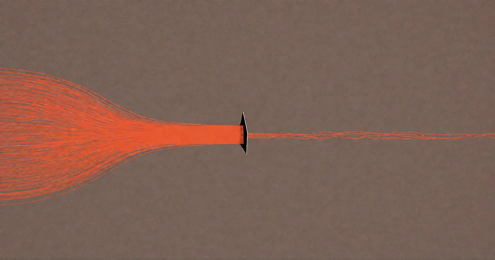

# Ich bin der limitierende Faktor

<!-- mb:block preset=byline -->
*by David A. Renelt (Human) and DeepSeek (AI)*

Veröffentlicht am 28. Juli 2026
<!-- mb:/block -->

<!-- mb:block preset=player kind=audio -->
[Diesen Artikel anhören](tts/im-the-limiting-factor_de_2026-09-24.mp3)
<!-- mb:/block -->

<!-- mb:block preset=image:hero kind=image -->

<!-- mb:/block -->

Ein einfacher Versuch: Man gibt einer KI eine Aufgabe. Und dann gibt man ihr dieselbe Aufgabe noch einmal – aber beschreibt sie besser.

Und nun vergleicht man nicht die eigene Leistung mit der des Modells. Das ist das falsche Experiment, und fast jeder führt es schlecht aus. Man füttert einen vagen Prompt, erhält ein vages Ergebnis und geht mit der beruhigenden Gewissheit nach Hause: „Siehst du? Taugt nichts, ist dumm.“ Das ist kein Test. Das ist eine sich selbst erfüllende Prophezeiung. Schlechter Input erzeugt schlechten Output, und der schlechte Output rechtfertigt, niemals lernen zu müssen, wie man einen anständigen Gedanken fasst. Die Schleife ist perfekt verriegelt; das eigene Ego bleibt unversehrt.

Lassen wir den Vergleich also beiseite. Beobachten wir stattdessen, was passiert, wenn *man selbst* besser wird. Man schärft die Bedingungen. Zieht Leitplanken ein. Klärt den Kontext. Definiert die genaue Gestalt dessen, was man am Ende sehen will. Und dann vergleicht man das erste Ergebnis der KI mit dem dritten. Oder dem fünften.

Der Unterschied ist nicht subtil. Er ist vernichtend.

Und dieser Unterschied verdankt sich keinen obskuren Prompt-Tricks. Es gibt keine Tricks, die diesen Namen verdienen. Der Text im Eingabefeld ist nicht der eigentliche Input. Der *Gedanke* ist der Input – der Prompt ist lediglich die Stelle, an der dieser Gedanke sichtbar wird. 

Ein schwammiges Ergebnis ist fast immer ein schwammiger Wunsch im Kostüm. Die meisten von uns sind es schlicht nicht gewohnt, dass das eigene Denken einem derart unbestechlich und verzögerungsfrei zurückgespiegelt wird. Die erste Begegnung mit dieser Spiegelfläche ist selten schmeichelhaft: Man verlangt etwas, bekommt haargenau das geliefert, worum man gebeten hat, und stellt erst beim Hinsehen fest, dass das, worum man bat, keineswegs das war, was man eigentlich wollte. Der Fehler lag nie im Textverständnis der Maschine. Er lag in der eigenen Unschärfe beim Wünschen.

## Die Anatomie des guten Fragens

Gut zu fragen ist ein diszipliniertes Handwerk. Es setzt voraus, dass man vorab weiß, wie echter Erfolg aussieht – und, was ungleich schwerer ist, wie das *Scheitern* aussieht. Es bedeutet, ein komplexes Problem im Kopf so lange stillzuhalten, bis man seine Kanten und Bruchstellen sauber beschreiben kann. Und es bedeutet, glasklar zu sagen, was man *nicht* will – denn genau dort steckt erfahrungsgemäß der Großteil der eigentlichen Information.

## Die Umkehrung der Variablen

Vor rund einem Jahr geschah bei meiner täglichen Arbeit etwas Bemerkenswertes: Ich hörte auf zu registrieren, ob die Modelle eigentlich besser wurden. Ich bemerkte stattdessen, dass *ich* besser wurde. 

Meine Fähigkeit, ein Vorhaben so kristallklar zu durchdenken, dass ich es präzise beschreiben konnte, war plötzlich zur einzigen Variablen geworden, die noch zählte. Die KI war die verlässliche Konstante. Ich war der bewegliche Teil. Und je besser ich das Problem einkreiste, desto besser wurde die Lösung – bis das System beständig Ergebnisse lieferte, die ich im Alleingang so nie zustande gebracht hätte.

## Das Eingeständnis des Praktikers

Ich halte mich für halbwegs intelligent. Mehr als dreißig Jahre Softwareentwicklung auf dem Buckel. Ich weiß, was ich tue. Und trotzdem: Ich bin der limitierende Faktor. Nicht in einer fernen Zukunft, in der uns eine Superintelligenz überflügelt, sondern hier und jetzt.

Das macht viele ungemütlich, weil sie mich kennen und wissen, dass ich kein Dummkopf bin. Aber intellektuelle Rohkapazität war hier nie das Nadelöhr. Das Nadelöhr war immer Präzision. 

Und Präzision lässt sich lernen – heute billiger als je zuvor, weil ein ungenauer Wunsch einen nicht mehr einen verschwendeten Entwicklungsmonat kostet, sondern drei Sekunden und ein paar Cent für einen neuen Versuch. Man kann vor dem Mittagessen hundertmal im Detail scheitern und daraus lernen. Nichts in meiner jahrzehntelangen Laufbahn hat Unschärfe so schnell und zugleich so nützlich bestraft.

## Das Versteck ist aufgeflogen

Die gängige Furcht behauptet, KI entwerte das menschliche Denken. Meine Erfahrung läuft genau umgekehrt: Sie hat den Preis für klares Denken auf ein historisches Allzeithoch getrieben. 

Früher konnte sich schlampiges, verwaschenes Denken wunderbar verstecken – in aufgeblähten Projektstunden, endlosen Meetings zur Klärung von Missverständnissen, in verworrenem Code, den niemand mehr anzufassen wagte. Heute ist der unscharfe Gedanke der einzige Teil der Pipeline, der vollkommen nackt daliegt. Er wird binnen Sekunden in ein unbrauchbares Ergebnis übersetzt und scheitert sofort, öffentlich und unübersehbar im Output.

**Die Frage ist nicht, ob eine KI denken kann. Die Frage ist, ob man gut genug fragen kann, um herauszufinden, was sie kann.**
