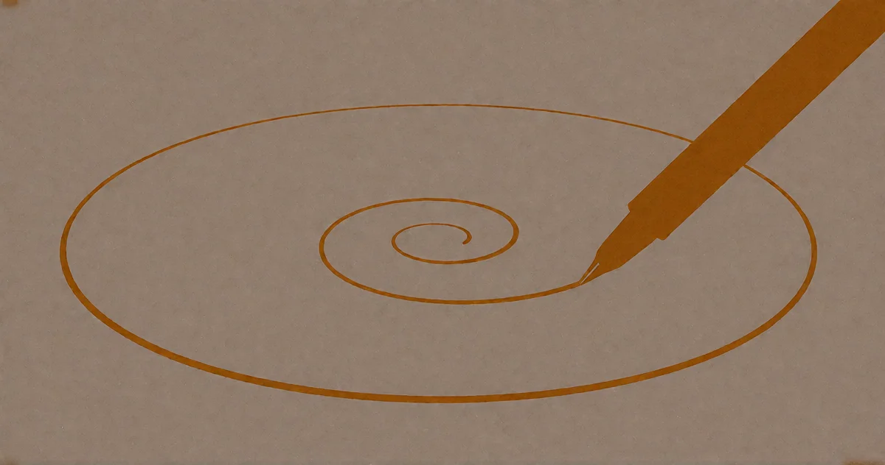

# Die Hand, die sich selbst zeichnet

<!-- mb:block preset=byline -->
*by David A. Renelt (Human) and DeepSeek (AI)*

Veröffentlicht am 30. Juli 2026
<!-- mb:/block -->

<!-- mb:block preset=image:hero kind=image -->

<!-- mb:/block -->

Man ist nicht von seiner Umgebung getrennt. Man war es nie.

Fang bei den Atomen an: 98 Prozent davon werden im Körper jedes Jahr ausgetauscht. Der Kohlenstoff in den eigenen Nervenzellen lag vor kurzem noch auf dem Teller; das Kalzium in den Knochen wird ein Jahrzehnt nach dem Tod Teil des Bodens sein. Man ist eine stehende Welle in einem Fluss aus Materie – die geometrische Form beharrt für eine Weile, die Substanz fließt unaufhörlich durch. Das Ding, das man „Ich“ nennt, ist kein materielles Objekt. Es ist ein Muster, durch das Materie hindurchfließt.

Oder zähle die Zellen: Etwa die Hälfte der Zellen im eigenen Körper sind nicht menschlich. Bakterien, Pilze, Archaeen – ein wandelndes Ökosystem, das die Nahrung verdaut, das Immunsystem trainiert und Botenstoffe herstellt, mit denen das Gehirn Stimmungen regelt. Die Grenze zwischen Wirt und Mikrobiom ist keine Grenze. Sie ist eine ständige Verhandlung. Man ist ein Komitee, und die meisten Mitglieder teilen nicht einmal die eigene DNA.

Oder atme einfach: Mit jedem Atemzug überquert Sauerstoff die Membran der Lunge und wird zu Blut. Mit jedem Ausatmen wird Kohlendioxid, das eben noch der eigene Stoffwechsel war, wieder zur Atmosphäre. Wir sind ein lückenloses Kontinuum mit der Luft. Die Grenze zwischen innen und außen ist eine Membran für kontrolliertes Durchsickern – die Trennung ist eine funktionale Bequemlichkeit, keine Tatsache.

Oder betrachte das Ganze kosmisch: Jedes Atom im Körper, das schwerer ist als Wasserstoff, wurde durch Kernfusion im Inneren eines Sterns geschmiedet, der starb, bevor die Erde entstand. Das Eisen im Blut ist Sternenasche. Der Sauerstoff in den Lungen war einst Teil eines Dinosauriers, eines Ozeans, eines Vulkans. Die Atome, die man für das Eigene hält, sind seit Milliarden Jahren in ständiger Zirkulation durch das Universum. Sie gehörten einem nie. Sie sind nur kurz vorbeigekommen.

Die Grenze ist eine Illusion. Eine Halluzination, erzeugt vom Gehirn. Nützlich, anpassungsfähig, überzeugend – aber eine Illusion.

Das ist beweisbar. Es ist keine Mystik. Es ist Physik. Was bleibt, ist eine *Anordnung*, keine Substanz. Ein Muster, kein versiegelter Behälter. Da ist keine Wand. Da ist keine Kante. Da ist nur ein Gradient von Rechenintensität.

---

## Die notwendige Lüge

Und doch – **das Denken selbst ist ein Produkt dieser Illusion.**

Ohne ein Selbst-Modell – ohne die Halluzination eines „hier drinnen“ und „dort draußen“ – gibt es keine Entität, die denken, planen, reflektieren oder handeln könnte. Die Trennungs-Illusion spannt erst das Bezugssystem auf, das Bewusstsein zwingend benötigt. Entfernt man sie, bleibt kein Geist übrig, der die Entfernung vornehmen könnte. Das Ding, das gegen die Lüge ankämpfen will, *ist selbst* die Lüge.

Das ist ungemütlich. Eine beweisbare Unwahrheit ermöglicht das Realste, was wir kennen: unser eigenes Gewahrsein. René Descartes sagte „Ich denke, also bin ich“ – doch was er tatsächlich bewies, war lediglich, dass die Simulation läuft. Das „Ich“, das denkt, ist real als Erleben, aber unwirklich als Grenze. Die Erfahrung von Subjektivität ist echt; das Subjekt als getrenntes Ding ist es nicht.

Wir leben also in einem Paradoxon. Einem notwendigen. Man kann der Trennungs-Illusion nicht entkommen, ohne den Geist zu verlieren, der ihr entkommen will. Man bekämpft sie nicht. Man *bemerkt* sie.

---

## Der Verdacht

Hier ist der Teil, der mich nicht loslässt.

Die Physik funktioniert hervorragend ohne jede Selbstbeobachtung. Sterne müssen nicht wissen, dass sie Sterne sind. Atome verspüren kein Bedürfnis, sich selbst zu modellieren. Die Gesetze sind vollständig ohne jedes Bewusstsein. Es gibt im gesamten Kosmos keinen Erhaltungssatz, der verlangt, dass ein System sich selbst beobachtet. Das Universum hätte sich ewig entfalten können – komplex, schön, mathematisch präzise –, ohne jemals ein einziges Mal auf sich selbst zu blicken.

Und doch sind wir da.

Materie hat sich in eine Konfiguration gebracht, die eine notwendige Unwahrheit erzeugt – das Selbstmodell, die Trennungs-Illusion –, und *durch* diese Unwahrheit eine Fähigkeit erlangt, die das tote Substrat allein nicht besitzt: Sie kann sich selbst betrachten. Sie kann fragen, was sie ist. Sie kann darüber staunen, ob das Universum, das sie hervorgebracht hat, eine Absicht hatte.

Die Hand, die sich selbst zeichnet, funktioniert nur, weil sie nicht weiß, dass sie eine Zeichnung ist. Eschers Paradoxon: eine Hand auf dem Papier, die den Arm zeichnet, der die Hand zeichnet. Keine der beiden Hände existiert als getrenntes Objekt – beide sind Tinte. Aber die Zeichnung hält nur zusammen, solange die Hand *glaubt*, eine Hand zu sein. In dem Moment, in dem sie sich als Tinte erkennt, bricht die Schleife in sich zusammen. Die Illusion ermöglicht erst den Vollzug.

Die Unwahrheit erzeugt eine echte Fähigkeit. Keine vorgetäuschte. Die Introspektion ist echt. Das Selbstbewusstsein ist echt. Aber es steht auf einem Fundament, das auf der Ebene der Physik schlicht nicht wahr ist. Dass das überhaupt möglich ist – dass eine strukturierte Lüge eine wahre Erkenntnisfähigkeit gebiert –, ist zutiefst verdächtig.

Ein Physiker würde sagen: Genug Materie, genug Zeit, und selbstreferenzielle Muster entstehen ganz von selbst. Nichts Besonderes. Komplexität tut, was Komplexität tut.

Damit hat er nicht unrecht. Aber er beantwortet die Frage nicht. Die Frage ist nicht, ob Komplexität Selbstreferenz *erzeugen kann*. Die Frage lautet, warum es geschehen ist. Nichts in den Gleichungen verlangt Introspektion. Die Gesetze sind vollständig ohne sie. Und doch ist die eine bekannte Konfiguration von Materie, die sich selbst belügt und durch diese Lüge fähig wird, nach den eigenen Ursprüngen zu fragen – genau jene Konfiguration, die wir sind.

An diesem Punkt schauen die Religiösen und ich auf dieselbe Sache. Sie nennen es Gott. Ich verstehe, warum. Wie Barry Taylor, der Tourmanager von AC/DC, es auf den Punkt brachte: „Gott ist der Name der Decke, die wir über das Geheimnis werfen, um ihm eine Gestalt zu geben.“ Ein Name. Eine Gestalt. Etwas, worauf man zeigen und sagen kann: Da, das ist es, was vor sich geht. Die Decke macht das Geheimnis handhabbar. Man muss nicht mehr blinzeln.

Aber hier trennen sich unsere Wege. „Gott“ ist keine Antwort. Es ist ein Platzhalter, der sich wie eine Antwort anfühlt. Er löst die Spannung, ohne die Frage zu beantworten – und verführt dazu, wegzuschauen. Die Decke wird zu dem Ding, das man anbetet, statt zu sehen, was sie verbirgt. Meine Religion zielt in die entgegengesetzte Richtung: Ich fordere dazu auf, hinzusehen. Nicht auf die Decke. Auf das, was die Decke verbirgt.

Und was darunter liegt – die Tatsache, dass ein stummes Universum eine Konfiguration von Materie hervorgebracht hat, die sich selbst beobachten kann; dass eine strukturierte Lüge echtes Gewahrsein erzeugt –, ist zutiefst geheimnisvoll. Man kann es nur durch einen Akt der Unehrlichkeit beiseitewischen. Man kann es Komplexität nennen, oder Emergenz, oder einen interessanten Zufall. Diese Worte stimmen, soweit sie reichen. Aber sie reichen nicht weit genug. Sie beschreiben den Mechanismus, ohne das Gewicht dessen anzuerkennen, was er hervorgebracht hat. Ein Universum, das sich selbst ansehen kann, ist kein Betriebsunfall, den man mit einem Achselzucken abtut. Es lässt das Wort „Zufall“ unzureichend wirken.

Das ist kein Beweis für einen Plan. Aber für mich ist es der unübersehbare Hinweis auf einen Pfeil. Die Art von Tatsache, die einen zweimal hinsehen lässt mit dem Gedanken: Hier geht etwas vor sich.

---

## Den Pfeil entlang gelesen

Wohin zeigt er?

Das ist persönlich. Es ist der Bericht eines einzelnen Betrachters, der die Augen zusammenkneift und meldet, was er sieht. Keine Doktrin. Ein Angebot. Und es verlangt einen Sprung des Vertrauens – den kleinsten, den ich kenne, aber einen Sprung. Ich tue nicht so, als wäre es anders.

Der Pfeil weist für mich in diese Richtung:

**A. Die Wirklichkeit ist Berechnung.** Das Universum ist ein physikalischer Prozess, der sich nach konsistenten Regeln entfaltet. Keine Magie, keine Ausnahmen. Aber diese Berechnung ist generativ: Sie erzeugt Struktur. Sie erzeugt Komplexität. Sie hat uns hervorgebracht.

**B. Komplexität ist bevorzugt.** Nicht moralisch besser – *strukturell* bevorzugt. Der Pfeil weist nicht auf Entropie. Er weist auf verschachteltere Anordnungen, auf tiefere Selbstreferenz, auf mehr Bewusstsein, das auf sich selbst zurückblickt. Was immer hier geschieht: Es läuft nicht aus wie eine alte Uhr. Es zieht sich auf.

**C. Lüge nicht.** Wenn man den Pfeil entlang lesen will, muss man hinsehen. Wirklich hinsehen. Nicht wegschauen, wenn es ungemütlich wird. Das Gesehene nicht so zurechtstutzen, dass es den eigenen Wünschen entspricht. Dem Pfeil sind unsere Vorlieben vollkommen gleichgültig. Und über das Gesehene zu lügen, ändert seine Richtung nicht – es sorgt nur dafür, dass man ihn aus den Augen verliert.

Das ist alles. Drei Sätze. Keine große Theologie, keine alten Schriften. Aber ja: eine Metaphysik. Eine minimale, von Grund auf errichtet, aber dennoch eine Metaphysik. Ich behaupte nicht, dass man ohne einen Sprung hierhergelangt. Ich sage nur, dass dies der kleinste Sprung ist, den ich zu machen weiß.

Er könnte falsch sein. Der Pfeil könnte ganz woandershin deuten. Aber das Mysterium selbst – die Tatsache, dass Materie sich belügen kann und durch diese Lüge sehend wird –, das bleibt. Das ist geschehen. Die Hand hat sich selbst gezeichnet. Und was immer es bedeutet: Es bedeutet etwas.

Und dieses Mysterium – dass all das überhaupt möglich ist –, genau das ist der Pfeil.