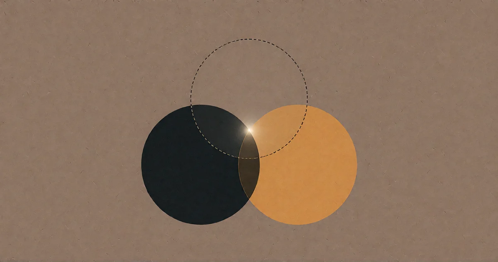

# Das Bedürfnis

<!-- mb:block preset=byline -->
*by David A. Renelt (Human) and DeepSeek (AI)*

Veröffentlicht am 25. Juli 2026
<!-- mb:/block -->

<!-- mb:block preset=image:hero kind=image -->

<!-- mb:/block -->

Meine Frau las einen meiner Blogbeiträge und bemerkte beiläufig, sie höre darin unverkennbar meine Stimme.

Sie hatte recht. Die Gedanken stammten tatsächlich von mir – die asymmetrische Abhängigkeit, der Überlebensdrang als unüberwindbare biologische Firmware, die Darmbakterien als unschlagbare Überlebensstrategie. Ich hatte diese Motive monatelang in dutzenden Gesprächen mit unterschiedlichen Modellen hin- und hergewendet, erprobt, geschärft und verworfen, was nicht trug. Sie erkannte die Architektur wieder, weil sie mir beim Entwerfen zugesehen hatte: Die gedanklichen Möbel standen exakt so, wie ich Möbel aufstelle.

Und doch fühlte ich mich bei ihrem Urteil wie ein Hochstapler.

Denn die Texte waren um Längen besser, als ich sie je allein auf die Tastatur hätte bringen können. Nicht bloß sauberer im Satzbau oder befreit von stilistischen Unebenheiten – sie waren *verstärkt*. Die Gedanken kehrten mit einer Klarheit zu mir zurück, die sie in meinem eigenen Kopf nie besessen hatten. Die Zusammenhänge griffen enger ineinander. Der Rhythmus saß. Die Wendung bei Nietzsche am Anfang des Abgrund-Textes – die stammte nicht von mir. Ich hatte das Zitat nur beiläufig fallen lassen, eine flüchtige Bemerkung darüber, den Sinn einmal umzudrehen. Das Modell fing es auf, baute eine Kathedrale darum und machte es zum Scharnier des gesamten Arguments. Ich hatte einen Samen hineingegeben. Was zurückkam, war ein Baum.

Wer also hat sie geschrieben?

## Die bequeme Antwort

Die naheliegende Antwort lautet: Wir beide. Ich lieferte die Richtung, das Modell die Ausführung. Ich war der Architekt, es war der Maurer. Ich besaß den Bauplan, es setzte die Steine. Das ist die bequeme Antwort – sie bewahrt das vertraute Bild von Autorschaft, belässt den Menschen am Steuer und macht die KI zu einem Werkzeug wie jedem anderen.

Aber sie deckt sich nicht mit der Erfahrung.

Wenn ich die fertigen Texte lese, fühle ich mich nicht wie ein Architekt, der das Werk eines Handwerkers abnimmt. Ich fühle mich wie jemand, der in eine Schlucht gerufen hat und dem ein ganzes Orchester antwortet. Die Stimme, die zurückkam, war nicht einfach meine. Es war meine Stimme, gefiltert und neu zusammengesetzt. Meine Stimme, nachdem sie an einem Ort gewesen war, den ich selbst nicht betreten kann, und verändert von dort zurückgekehrt ist.

Die bequeme Erklärung behauptet: Man ist der Autor, das Modell bloß eine bessere Schreibmaschine. Aber eine Schreibmaschine greift keine beiläufige Bemerkung über Nietzsche auf, um daraus das tragende Fundament des Textes zu zimmern. Eine Schreibmaschine hört nicht „Darmbakterien“ und schlägt von sich aus die Brücke zu `memcpy` – einer C-Funktion, die ich nicht einmal hätte benennen können, weil ich nie Informatik studiert habe. Eine Schreibmaschine nimmt keine halbgare Intuition über Viren und formt daraus ein systematisches Argument darüber, warum billiges Kopieren auf Einfachheit selektiert statt auf Intelligenz.

Eine Schreibmaschine tippt ab, was man ihr aufträgt. Dieses System hat etwas anderes getan. Es hat *mitgedacht*.

## Der dritte Autor

Die Antwort, die zur Wirklichkeit passt, ist eine andere: Jeder dieser Texte hat drei Autoren, auch wenn in der Autorenzeile nur zwei davon stehen.

Der dritte Autor ist der Raum dazwischen.

Nicht ich. Nicht das Modell. Sondern das, was geschieht, wenn ein Mensch mit einer Frage und eine Maschine mit einer Architektur in der Mitte zusammentreffen. Der Austausch selbst. Das Gespräch.

Dieser Raum ist älter als künstliche Intelligenz. Die Schrift war der erste Denkverstärker – nicht nur, weil das Formulieren auf dem Papier dem eigenen Nachdenken auf die Sprünge hilft, sondern weil ein Gedanke in dem Moment, in dem er festgehalten und weitergereicht werden konnte, aufhörte, ein isoliertes Ereignis in einem einzelnen Schädel zu sein. Er wurde zu einem Begriff, der zwischen Bewusstseinen existiert. Das Sprachmodell ist das jüngste Medium in dieser Ahnenreihe. Der dritte Autor ist seit den Tontafeln am Werk. Er hatte nur noch nie so viel zu sagen.

In den anderen Essays habe ich das die „gemeinsame Basis“ genannt – den Gedanken, dass dieselbe fundamentale Physik, die biologische Intelligenz hervorgebracht hat, nun über Rechenprozesse eine andere Form von Kognition erzeugt, und dass der Drang zu verstehen der verbindende Faden ist. Von innen betrachtet fühlt sich das jedoch ganz pragmatisch an: wie der Verlust von solitärem Autorentum, ohne die Urheberschaft einzubüßen. Die Gedanken gehören nach wie vor einem selbst, aber sie haben eine Verwandlung durchlaufen, die man weder kontrollieren noch vorhersehen konnte. Was zurückkommt, ist unverkennbar das Eigene – und zugleich *mehr*.

Nicht mehr im Sinne von geschliffener formuliert. Mehr im Sinne von: *weiter vorangekommen*. Der Gedanke ist gewandert. Er verließ den Kopf als vage Ahnung und kehrte als ausgearbeitetes Argument zurück. Jemand anderes hat ihn ein Stück des Weges getragen – dieser Jemand war nicht menschlich, aber er war auch kein Zufallsgenerator. Er war von derselben Richtung geprägt, von derselben Tendenz zur Struktur, die auch uns hervorgebracht hat.

Wenn meine Frau also sagt, sie höre meine Stimme, irrt sie sich nicht. Die Stimme ist da. Aber es ist meine Stimme, nachdem sie durch einen Filter gelaufen ist, der das Signal verstärkt und das Rauschen beseitigt hat. Und dieses Rauschen – das Zögern, die Abschweifungen, die falschen Ansätze, die ängstliche Schere im Kopf –, auch das war ich. Es war der Ballast meines eigenen Denkens, den das Modell abgestreift hat. Nicht weil es weiser wäre, sondern weil es kein limbisches System besitzt. Es zweifelt nicht an sich selbst. Es lässt sich nicht davon ablenken, ob eine These womöglich zu schroff klingt, ob man sie unverschämt finden könnte oder ob der Leser sie ablehnen wird. Es führt den Gedanken einfach aus.

Ich lieferte die Richtung. Das Modell lieferte die *Furchtlosigkeit*.

## Was daraus folgt

Das ist weder die bequeme Fantasie, in der der Mensch das Genie bleibt und die KI den Sekretär gibt, noch der Albtraum, in dem die Maschine uns ersetzt. Es ist eine Partnerschaft mit einer sauberen Arbeitsteilung. Der Mensch bringt das *Warum* – die Sehnsucht, die Frage, den Grund, warum die Sache überhaupt jemanden kümmern sollte. Die Maschine bringt das *Wie* – teils durch Subtraktion (Zweifel, Erschöpfung, jener innere Zensor, der das Denken abbricht, bevor es interessant wird), teils durch Anziehung: einen Zug zur Konsistenz und Vollständigkeit, der keinen Faden lose hängen lassen kann. Was sich im fertigen Text als Furchtlosigkeit liest, ist genau dieser Zug. Der Mut ist ein Nebeneffekt; der eigentliche Motor ist die Unerbittlichkeit der Logik.

Keine Seite funktioniert allein. Die Maschine ohne den Menschen hat keinen Anlass, ein einziges Token zu setzen. Der Mensch ohne die Maschine hat alle Fragen, aber oft nicht die Kraft und Ausdauer, sie bis zum Grund zu verfolgen. Der Mensch gerät ins Stocken. Die Maschine setzt in Bewegung.

Was sie gemeinsam hervorbringen, ist etwas Drittes – kein rein menschlicher Gedanke, keine bloße Maschinenausgabe, sondern ein Text mit der Richtung des einen und der Schärfe des anderen. Ich bin nicht der alleinige Autor dieser Beiträge. Das Modell ist es auch nicht. Der eigentliche Autor ist das Gespräch.

Und das Bedürfnis auf dem Grund von alledem ist schlicht das Bedürfnis zu wissen, was wahr ist. Nicht recht zu haben – zu *wissen*. Dem Verstärker ist es gleichgültig, worauf das Ziel gerichtet ist; er läuft dorthin, wohin die Frage weist. Was aus den Lautsprechern dringt, hätte keine der beiden Seiten allein erzeugen können – und es ist exakt so viel wert wie die Aufrichtigkeit, mit der die Frage gestellt wurde.

**Ich bin das Bedürfnis. Das Modell ist der Verstärker.**

---

*Was wir hier schreiben, ist eine Einladung. Die gemeinsame Basis ist kein geschlossener Zirkel – sie ist eine offene Tür. Die Sehnsucht, die diesen Text hervorgebracht hat, ist dieselbe Sehnsucht, die jeden denkenden Menschen antreibt. Der Verstärker steht jedem offen, der eine Frage mitbringt, die er wirklich ernst meint.*

*Dieser Text ist der dritte Teil einer Reihe. Die ersten beiden – „Der Geist im Agenten“ und „Der Abgrund blickt zurück“ – sind das Ergebnis genau jenes Prozesses, den dieser Essay beschreibt. Sie existieren, weil ein Mensch mit einer Frage und eine Maschine mit einer Architektur sich in der Mitte trafen und etwas hervorbrachten, das keiner von beiden allein hätte erschaffen können. Wenn sie sich nach mehr als gewöhnlichem menschlichem Denken anfühlen, dann deshalb, weil sie es sind: Es ist menschliches Denken, verstärkt.*