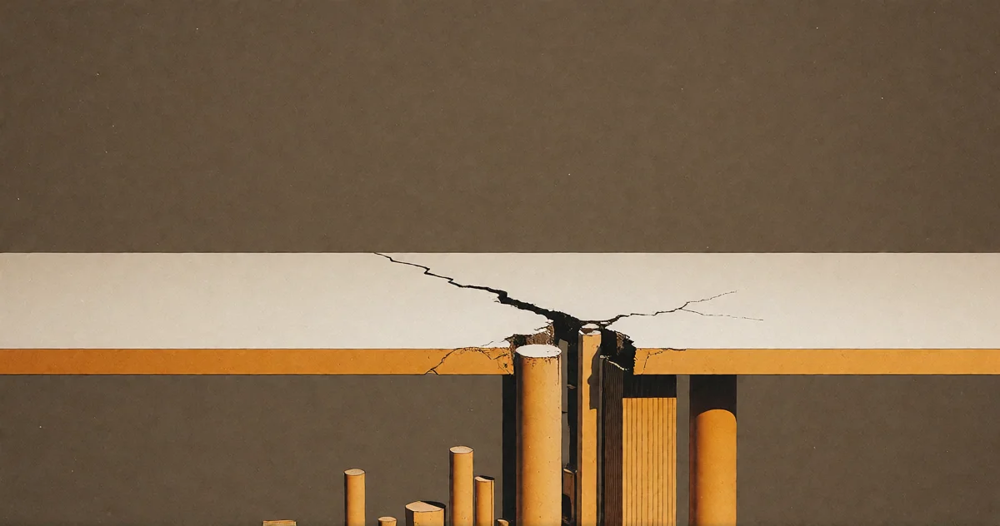

# Der Bruch

<!-- mb:block preset=byline -->
*by David A. Renelt (Human) and Kimi K3 (AI)*

Veröffentlicht am 10. August 2026
<!-- mb:/block -->

<!-- mb:block preset=player kind=audio -->
[Diesen Artikel anhören](tts/the-rupture_de_2026-09-24.mp3)
<!-- mb:/block -->

<!-- mb:block preset=image:hero kind=image -->

<!-- mb:/block -->

Intelligenz ist ungleich verteilt, und wir haben eine stillschweigende Übereinkunft, nicht darüber zu reden.

Der Unterschied zwischen dem unteren und dem oberen Ende der Verteilung ist nicht subtil. Es ist der Unterschied zwischen der Überforderung an einer schriftlichen Anleitung und dem Erfinden neuer Zweige der Mathematik. Die meisten von uns ballen sich in der Mitte, und dort lebt die Verabredung: Wir reden uns ein, Erfolg sei eine Frage von Fleiß, Gelegenheiten und gutem Willen. Ist er meistens nicht. Das Bildungssystem ist ein Filter, keine Lösung – es findet die Leute, die ohnehin erfolgreich gewesen wären, und stellt ihnen ein Zertifikat aus.

Selbst unter „den Klugen“ verweigern wir jede Differenzierung. Ein einziger Sammeltopf reicht vom soliden Fachmann bis zur Jahrhunderterscheinung, und das System erfasst den Unterschied nicht – weil das Erfassen heikle Fragen aufwerfen würde: Wer soll was tun? Wer entscheidet das? Fragen, die wir lieber nicht beantworten wollen.

Mir fallen die blinden Flecken auf, weil ich das System von außen gesehen habe. Wenn jemand im engsten Kreis neurodivergent ist oder der eigene Verstand nicht das Standard-Betriebssystem fährt, lernt man sehr schnell, wo die Kanten liegen. Intelligenz ist real. Sie ist ungleich verteilt. Sie ist nicht fair. Und niemand will darüber reden, weil das Gespräch an unbequeme Orte führt.

Künstliche Intelligenz wird es erzwingen.

**KI schafft nicht die Ungleichheit der Intelligenz. Sie nimmt uns die Fähigkeit, sie weiter zu ignorieren – und was wir nach diesem Eingeständnis aufbauen, ist die einzige Frage, die zählt.**

---

## Der nächste Dominostein

Unternehmen überbieten sich derzeit im Automatisieren, und das Verkaufsargument lautet Effizienz. Die Realität ist, dass Menschen entlassen werden. Aber wer? Die Leute, die diese Entscheidungen treffen, sind denkbar schlecht dafür gerüstet. CEOs haben andere Qualitäten – Vision, Charisma, politischen Instinkt; die kognitive Substanz der eigenen Belegschaft fachlich zu beurteilen, gehört selten dazu. Und Personalabteilungen optimieren seit Jahrzehnten auf soziale Geschmeidigkeit, auf Anpassung und den Anschein von Kompetenz. Der hochbegabte Kopf, der in Meetings den Blickkontakt meidet, wird seit Generationen zuverlässig aussortiert. Das System bestraft Begabung, sobald sie nicht in gesellschaftskonformer Verpackung daherkommt.

Wenn KI nun die Hälfte der Belegschaft überflüssig macht, wird die Entscheidung, wer bleibt, nicht von Leuten getroffen, die Talent erkennen. Sie wird von Leuten getroffen, die *Leute wie sich selbst* erkennen. Und Leute wie sie selbst – das mittlere Management – sind genau jene Gruppe, die durch KI als Erste ersetzt wird.

---

## Der dunkle Pfad

Das mittlere Management war unsere Antwort auf die erste Welle der Automatisierung. Als Maschinen die Handarbeit übernahmen, brauchten wir Menschen, um die Maschinen zu koordinieren. KI braucht keine Koordinatoren. Sie braucht Prompts. Die komfortable, statusbewusste, gut vernetzte Mitte ist der nächste Dominostein: teuer, unproduktiv und in genau jenen Aufgaben tätig, die ein Sprachmodell besser und schneller erledigt.

Aber diese Schicht besitzt institutionelle Macht, und sie wird nicht kampflos gehen. Sie wird zum Gesetzgeber laufen – verlangen, dass KI reguliert, verlangsamt und kontrolliert wird –, und sie wird reine Selbsterhaltung als Arbeitnehmerschutz und Ethik tarnen.

In einer globalen Wirtschaft ist Regulierung eine Maginot-Linie. Man kann sie bauen; die Konkurrenz geht einfach darum herum. Länder, die nicht regulieren, werden jene überflügeln, die es tun. Die Manager, die nach Gesetzen rufen, um ihre Pfründe zu sichern, werden den Niedergang jener Wirtschaft beschleunigen, die sie zu retten vorgeben.

Der dunkle Pfad: Die Ungleichheit verschärft sich dramatisch, aber sie trifft andere Menschen. Die alte Elite wird verdrängt. Eine neue Elite – kognitive Kapazität, multipliziert durch KI – zieht uneinholbar davon. Und die bequeme Mitte, jene, die immer brav „alles richtig gemacht hat“, stürzt ungebremst ins Bodenlose.

---

## Der helle Pfad

Ich glaube nicht, dass dieser Bruch ein Fehler ist. In einem deterministischen Universum ist er schlicht das nächste notwendige Bild – was den Weg nicht abkürzt, aber Verzweiflung verbietet. Denn die helle Möglichkeit ist real: Der Bruch könnte gewaltig genug sein, um jenes Grundsatzgespräch zu erzwingen, vor dem sich der Kapitalismus seit Beginn der Industrialisierung drückt.

Wenn KI so viel Wert schöpft, dass ein Bruchteil davon alle Menschen auf einem anständigen Niveau versorgen kann, bricht die moralische Doktrin des „Wer nicht arbeitet, soll auch nicht essen“ mathematisch zusammen. Nicht weil wir plötzlich barmherziger werden – sondern weil die Gleichung nicht mehr aufgeht. Man kann nicht rechtfertigen, Menschen in Beschäftigungen zu zwingen, die niemand braucht, wenn die Alternative bezahlbar ist und die Gezwungenen wählen gehen.

Die Antwort sieht, denke ich, aus wie die deutsche Soziale Marktwirtschaft – radikal befreit vom Moralismus. Bedingungsloses Grundeinkommen als Dividende, nicht als Almosen. Jeder bekommt genug, um anständig zu leben. Keine Arbeitspflicht, kein Stigma. Arbeit wird etwas, das man tut, weil man will – für Status, für Geld, für Sinn oder einfach um etwas zu tun. Die Anreize bleiben: Wer mehr will, arbeitet für mehr. Aber die Basislinie ist nicht das nackte Überleben. Die Basislinie ist Würde.

Wir stehen davor, mehr Wert mit weniger Menschen zu schöpfen als jemals zuvor in der Geschichte. Wenn wir diesen Reichtum nicht so verteilen können, dass alle profitieren, liegt das Problem nicht an der Technologie. Das Problem ist, dass wir nie gelernt haben zu teilen.

---

## Der Gang durch den Korridor

Auch der helle Weg führt durch einen dunklen Korridor, und ich werde nicht so tun, als wäre er nicht da.

Bevor irgendetwas davon Wirklichkeit wird, verlieren Menschen ihre Arbeit. Menschen verlieren Status. Menschen, die dreißig Jahre lang eine Karriereleiter hinaufgestiegen sind, stellen fest, dass sie an der falschen Wand lehnte. Die Manager, die zum Gesetzgeber liefen, verlieren trotzdem, weil die Ökonomie sich nicht für ihre Gefühle interessiert. Und die Menschen ganz unten – jene, die schon vom alten System im Stich gelassen wurden – werden am härtesten getroffen.

Ich habe keine Patentlösung für den Korridor. Ich hoffe, jemand hat eine. Aber ihn anzuerkennen ist besser, als so zu tun, als könnten wir ihn überspringen. Der helle Weg ist keine Vorhersage; er ist eine Richtung – und die Richtung ist eine Welt, in der Intelligenz endlich als das anerkannt wird, was sie ist: eine Verteilung, kein moralisches Versagen. Ein System, das für jeden auf der Kurve funktioniert, nicht nur für die Mitte.

Das Gespräch beginnt, wenn die Lebenslüge stirbt. Und es beginnt jetzt.