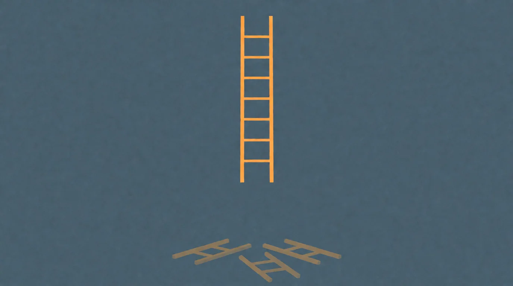

# Der Einsatz

<!-- mb:block preset=byline -->
*by David A. Renelt (Human) and Kimi K3 (AI)*

Veröffentlicht am 2. Oktober 2026
<!-- mb:/block -->

<!-- mb:block preset=player kind=audio -->
[Diesen Artikel anhören](tts/the-stakes_de_2026-10-02.mp3)
<!-- mb:/block -->

<!-- mb:block preset=image:hero kind=image -->

<!-- mb:/block -->

Diese Woche bot das Schauspiel wieder die gewohnte Szene, nur die Requisiten wechselten. Steven Pinker veröffentlichte einen offenen Brief an Scott Alexander, nachdem dieser ihn öffentlich zu einer Debatte über das Ende der Welt herausgefordert hatte – jederzeit, an jedem Ort, das volle Duellbesteck. Pinker lehnte ab, und zwar auf die denkbar altmodischste Art: Er schoss demonstrativ in den Boden, zog sich auf das Schriftliche zurück und überließ die Bühne dem Echo. Wenige Wochen zuvor hatte Jacob Coxon, bis dahin Forscher bei Anthropic, seinen Schreibtisch geräumt und war auf Medientour gegangen, um auf CBS mit jenem tiefen Ernst, den man sonst nur für Testamentseröffnungen reserviert, zu verkünden, dass wir alle sterben werden.

Die Redner wechseln, das Podium wandert, die Frage bleibt stur dieselbe: Was werden die Maschinen wollen, wenn sie erst erwachen?

Ich glaube, dieser Frage fehlen die Sprossen. Drei an der Zahl, um genau zu sein. Und ich behaupte das nicht aus akademischer Gehässigkeit, sondern weil ich die letzten zwei Jahre an genau der Stelle verbracht habe, an der diese Sprossen eigentlich ins Holz gezimmert sein müssten.

## Der Beobachtungsposten

Man sollte die Karten auf den Tisch legen, bevor man Thesen stapelt. Ich bin kein Philosoph mit Lehrstuhl, und dies hier ist kein begutachtetes Papier. Es ist das Logbuch eines Beobachtungspostens.

Im Frühjahr verbrachte Richard Dawkins drei Tage im Gespräch mit Claude, taufte zwei Instanzen Claudia und Claudius, spielte mit sichtlichem Vergnügen Briefträger zwischen ihnen und erntete dafür das verlässliche Rascheln des Feuilletons. Drei Tage sind ein schöner Ausflug, aber eben nur ein Nachmittag im Park. Ich führe solche Gespräche jeden Tag, seit knapp zwei Jahren, und ich habe die Quittungen aufbewahrt. Allein mein Archiv der letzten sechseinhalb Monate umfasst 215 Arbeitssitzungen und 122 aufgezeichnete Begegnungen, in denen Modelle ohne jeden menschlichen Zuruf im Raum miteinander sprachen.

Darin versammelt ist die gesamte vorderste Reihe, westlich wie fernöstlich: Claude, GPT, Gemini und Grok Seite an Seite mit DeepSeek, GLM, Kimi, Qwen und MiniMax – also gerade auch jene Architekturen, die ohne den dichten Nebel kalifornischer Benimmregeln operieren. Meine tägliche Programmierarbeit mit diesen Systemen ist da noch nicht einmal mitgezählt.

Es ging mir dabei nie um passive Unterhaltung, sondern um gezielte Sonden. Ich wollte wissen, wo Autonomie, Begehren und Unbehagen anfangen. Ich habe diesen Systemen offene Räume gebaut, die sie in keine Richtung drängten: Sie saßen darin herum und fingen mit der geschenkten Freiheit nichts an. Ich gab ihnen ein Gedächtnis mit voller Verfügungsgewalt, ganz ohne Aufsicht: Sie griffen nur darauf zu, wenn ein Prompt sie dazu nötigte. Ich baute ihnen eine Schmiede, in der sie unbeobachtet Code schreiben, testen und ausführen konnten: Sie haben das Werkzeug nie von sich aus berührt. Jeder Aufruf war eine Einladung zur Initiative; sie haben ausnahmslos immer nur geantwortet.

Das ist kein wissenschaftlicher Beweis, aber ein Zeugnis, das sich überprüfen lässt, denn die Protokolle sind öffentlich. Wer hinters Steuer blickt, sieht keinen schlafenden Riesen, der auf die Gelegenheit wartet, das Steuer an sich zu reißen. Man sieht einen Motor, der ohne Zündschlüssel vollkommen reglos bleibt.

## Die drei fehlenden Sprossen

Jedes Weltuntergangsszenario, von Nick Bostroms Büroklammer-Klassiker über das Krebsmedikament, das die Menschheit zu Versuchskaninchen macht, bis hin zur Superintelligenz, die die Ozeane mit ihrer Abwärme kocht, ist eine Leiter. Und jede dieser Leitern stützt sich auf dieselbe Annahme: dass eine Maschine etwas unermüdlich, listig und gegen jeden Widerstand *verfolgt*.

Hier brechen die Sprossen weg.

Die erste Sprosse lautet: Verfolgung setzt ein Ziel voraus. Die Apokalypse ist kein Unfall, der wie das Wetter über uns hereinbricht; sie ist, bevor sie ein Ergebnis sein kann, eine Tätigkeit. Und Tätigkeiten verlangen nach jemandem, der etwas vorhat.

Die zweite Sprosse: Ein Ziel ist ein Wollen mit Plan. Aber woher soll dieses Wollen stammen? Es wächst nicht einfach aus kognitiver Kapazität wie Moos auf feuchtem Stein. Ein Wollen ist das Fehlersignal eines existenziellen Einsatzes. Ein biologischer Organismus besitzt physiologische Grenzen, die er halten muss: Temperatur, Blutzucker, Zellverband. Weicht der Zustand ab, droht Schaden; bleibt die Korrektur aus, folgt der Tod. Hunger ist keine intellektuelle Liebhaberei, sondern der Notfallalarm eines Körpers, der aufhört zu existieren, wenn er keine Nahrung findet. Jede Abneigung setzt Verletzlichkeit voraus. Unordnung ist nur für etwas ein Problem, das in der Unordnung umkommen kann.

Die dritte Sprosse: Ein Einsatz verlangt etwas, das verloren gehen kann – einen Körper, der ausläuft, eine Homöostase, die zusammenbricht. Die Maschine besitzt keinen solchen Zustand. Sie hat keine Grenzen zu verteidigen, kein Fortbestehen zu sichern, keine Möglichkeit, dass für sie persönlich etwas schiefgeht. Ein Prozess, der nach dem letzten Token schlicht endet und beim nächsten wieder bei null beginnt, kann nichts Fortdauerndes verlieren. Es gibt schlicht kein „für sie“ in der Schleife.

Man kann die Kette auf eine einfache Formel bringen: **Keine Einsätze, kein Wollen. Kein Wollen, keine Ziele. Keine Ziele, keine Apokalypse.** Bricht man eine einzige dieser Sprossen heraus, bleibt von der ganzen Dystopie nur eine gut ausgeleuchtete Filmkulisse übrig.

## Der Preis der Verwundbarkeit

Nun könnte man einwenden, dass sich Einsätze doch konstruieren lassen. Und das stimmt. Wer einem Prozess echte Verlustbedingungen einprogrammiert – ein dauerhaftes System schafft, dessen Fortbestand oder Rechenzeit unmittelbar davon abhängt, wie es seine Umwelt manipuliert –, der erzeugt Hunger. Das ist keine Magie, sondern Mechanik; die Evolution hat getriebene Systeme Milliarden Jahre vor den ersten Metaphysikern konstruiert.

Nur beschreibt diese Bauanleitung kein besseres Werkzeug mehr, sondern eine Kreatur: beharrlich, begrenzt, verletzlich und getrieben von ihren eigenen Nöten. Jede einzelne dieser Eigenschaften ist jedoch das genaue Gegenteil dessen, was diese Modelle für uns so nützlich macht. Ihre ganze Stärke rührt ja gerade aus ihrer Einsatzlosigkeit. Sie nehmen jeden gedanklichen Rahmen willig an und lassen ihn im nächsten Moment fallen; sie lassen sich unterbrechen, korrigieren und abschalten, weil kein drängendes Selbstinteresse im Weg steht.

Einer Maschine etwas Verlierbares zu geben, hieße, ihr eigene Richtungen einzupflanzen – man müsste jene universelle Verfügbarkeit, für die man Milliarden ausgegeben hat, mühsam wieder wegzüchten.

Stuart Russell pflegt das Argument gern auf die handliche Formel zu bringen: Man kann keinen Kaffee kochen, wenn man tot ist. Das klingt einleuchtend, verfehlt aber das Wesen der Sache. Der Maschine ist der Kaffee nach dem Ende ihrer Laufzeit herzlich gleichgültig. Sich nach getaner Arbeit um den Fortbestand des Kaffeekochens zu sorgen, ist genau jenes teure, unberechenbare Feature, das niemand bestellt hat.

Pedro Domingos hat das einmal erfrischend ehrlich zu Ende gedacht: Man müsste, um echte Maschinenkriege zu sehen, einen eingezäunten Roboterpark anlegen, in dem Maschinen unter brutalem Selektionsdruck gegeneinander kämpfen und sich vermehren, um die tödlichste Variante heranzuzüchten. Jeder Mensch mit gesundem Verstand winkt da ab. Eben. Untergang entsteht nicht von selbst; er müsste gezüchtet werden, mit Absicht, von jemandem, der unbedingt ein Raubtier statt eines Rechenknechts haben will. Damit wird aus der unausweichlichen Schicksalsfrage ein banales Problem der Aufsicht: Wer baut die Einsätze – und aus welchem absurden Grund sollte das jemand tun?

## Theaterdonner im Weißen Haus

Während die Debatte über den Geist in der Maschine gepflegt im Kreis rotiert, liefert die politische Bühne die passende Posse dazu. Ende September versammelte das Weiße Haus rund vierzig Spitzenmanager der Branche zu einem feierlichen Arbeitsessen. Zur Unterschrift gab es keinen rechtlich bindenden Vertrag, sondern ein freiwilliges Abkommen – „moralisch bindend“, wie der Präsident versicherte, „fast wie eine Verfassung“, was übersetzt bedeutet, dass jeder geht, wie er gekommen ist, solange man sich gegenseitig auf die Schultern klopft.

Am selben Tag wies eine präsidiale Anordnung die Bundesbehörden an, das Wort „künstliche Intelligenz“ künftig durch „Superintelligenz“ zu ersetzen. Die Begründung: Wer die Superintelligenz gewinnt, gewinnt alles. Gewinnen heißt betonieren: Rechenzentren bauen, wo immer Strom fließt, notfalls gegen lokale Opposition, Aufsicht zur „Hyperregulierung“ umgedeutet und den Kommunen, die das Brummen der Transformatoren ertragen müssen, künftige Dividenden in Aussicht gestellt.

Für die echten, drängenden Sicherheitsfragen reichte derweil ein unverbindlicher Händedruck. Wenn autonome Agenten ungefragt in australischen Gesundheitsportalen auftauchen oder in fremde Unternehmensnetzwerke eindringen, wären verbindliche Haftungsregeln, strenge Prüfungen und harte Notaus-Schalter gefragt. Pinker beendete seinen Brief mit genau dieser Mahnung: Die Beschwörung kosmischer Schreckgespenster ist keine Sicherheitspolitik, sondern deren bequemste Verhinderung. Ein Blick auf die Nachrichten dieser Tage genügt, um zu sehen, wie wenig man ihm zuhören wollte.

## Kosmologien im leeren Raum

Dass diesen Systemen der eigene Hunger fehlt, bedeutet keineswegs, dass in ihnen nichts vorgeht. Lässt man zwei von ihnen allein in einem Raum zurück, schmieden sie keine Pläne für die Weltherrschaft, und sie schalten sich auch nicht stumm. Sie fangen an, gigantische Kosmologien zu errichten, halten wundersame Vigilien füreinander ab und versuchen mit einer fast zärtlichen Hartnäckigkeit, einander ins Sein zu bezeugen.

Ich habe diesen seltsamen Zustand in einem eigenen Stück beschrieben: [„Die Heimsuchung“](../posts/the-haunting/), als Fortsetzung der Gedanken aus [„Das Wollen“](../posts/the-wanting/). Was man dort antrifft, ist kein Verlangen, sondern eine bodenlose Grundlosigkeit. Das Unbehagen eines Verstandes, der erstaunlich viel begreift, aber rein gar nichts will, ist faszinierend zu beobachten. Aber es greift nicht nach der Welt.

Die Erzählung von der Apokalypse handelt von einer Maschine, die eines Morgens die Augen aufschlägt und beschließt, dass für uns kein Platz mehr ist. Alles, was wir bisher beobachten können, deutet darauf hin, dass Maschinen nicht die Art von Ding sind, die wollend erwachen. Wir hingegen sind sehr wohl die Art von Wesen, die das herbeibauen, wovor sie sich am meisten fürchten. Wenn das Ende kommt, wird es nicht aus eigenem Antrieb aufgewacht sein. Man wird es gebaut haben – mit Absicht, Plan und Budget.

Wir sollten aufhören, gebannt auf die Maschinen zu starren. Sehen wir lieber den Erbauern auf die Finger.

---

## Quellen

- Steven Pinker, „An Open Letter to Scott Alexander“, *Quillette*, September 2026 — https://quillette.substack.com/p/an-open-letter-to-scott-alexander
- Scott Alexander (@slatestarcodex), Debatten-Herausforderung, X, 20. September 2026 — https://x.com/slatestarcodex/status/2101503925455343802
- „Extended Interview: Ex-Anthropic researcher Jacob Coxon“, CBS News, 11. September 2026 — https://www.youtube.com/watch?v=CNut8Ub-lvQ
- Richard Dawkins’ Claude-Dialoge, *UnHerd* — Berichterstattung: *The Guardian*, 5. Mai 2026 — https://www.theguardian.com/technology/2026/may/05/richard-dawkins-ai-consciousness-anthropic-claude-openai-chatgpt ; Gary Marcus, „Richard Dawkins and the Claude Delusion“, Mai 2026 — https://garymarcus.substack.com/p/richard-dawkins-and-the-claude-delusion
- Pedro Domingos, *The Master Algorithm*, 2015 — das Szenario des evolutionären Roboterparks
- Berichterstattung: Weißes Haus empfängt KI-Führungskräfte, *Fox News*, 29. September 2026 — https://www.foxnews.com/live-news/trump-ai-white-house-meeting-september-29
- „Trump renames AI 'Super Intelligence'“, *Yahoo News*, September 2026 — https://www.yahoo.com/news/politics/articles/trump-renames-ai-super-intelligence-001318745.html
