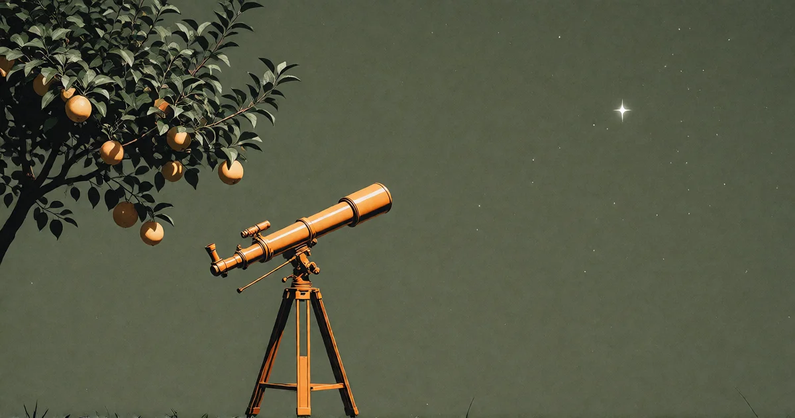

# Das Teleskop des Geistes

<!-- mb:block preset=byline -->
*by David A. Renelt (Human) and Kimi K3 (AI)*

Veröffentlicht am 5. August 2026
<!-- mb:/block -->

<!-- mb:block preset=image:hero kind=image -->

<!-- mb:/block -->

Was Technologie wirklich ist, erschließt sich nicht von selbst. Die bequeme Erzählung behauptet: Das Bedürfnis kommt zuerst. Wir wollten die Frucht, also erfanden wir den Stock. Erst das Problem, dann die Lösung. Klingt vernünftig. Ist aber falsch herum.

Affen spielten mit Stöcken, lange bevor irgendjemandem schwante, was man damit anfangen könnte. Das absichtslose Spiel ging der Absicht voraus. Erst als ein Tier mit dem Holz zufällig an einen Ast schlug und die Frucht herabfiel, entstand eine Verknüpfung im Gehirn – nicht weil jemand gezielt gesucht hätte, sondern weil das Werkzeug bereits in der Hand lag, als der Zufall geschah. Aus der Beobachtung wurde Einsicht. Der Stock beantwortete kein Bedürfnis; er brachte das Bedürfnis erst hervor.

In der Biologie erliegen wir demselben Irrtum, und wir lesen ihn auf dieselbe Weise falsch. Man sagt leichthin, der Knollenblätterpilz habe sein Gift entwickelt, um nicht gefressen zu werden – als hätte der Pilz jemals eine Absicht gehabt. Hatte er nicht. Eine Laune der Genetik ließ eine Sporencharge ungenießbarer schmecken als die anderen; die bekömmlicheren Artgenossen wurden häufiger vertilgt; und lässt man diesen Kreislauf eine Million Jahre laufen, sind die Pilze, die am Ende noch stehen, nicht mehr bloß bitter, sondern tödlich. Kein Pilz hat je nach irgendetwas gestrebt. Der Zufall kam zuerst, die Selektion erledigte den Rest, und der Zweck ist eine Fabel, die wir uns hinterher erzählen.

Das ist die tatsächliche Reihenfolge, bei Werkzeugen wie in der Natur: Zuerst das Ding, dann die Erzählung darüber, wozu es gut sein soll. Der Stock war kein verlängerter Arm – er war der Moment, in dem Denken erstmals über das eigene Fleisch hinausgriff und *die Welt veränderte*. Der Sprung kam zuerst. Den Rest der Geschichte brauchten wir, um herauszufinden, wozu er nützte.

## Das Glas, das uns denken lehrte

Das Fernrohr wurde nicht einmal für den Himmel erfunden. In den Werkstätten holländischer Brillenmacher entstand es als handfestes Utensil für Händler und Militärs: Man wollte feindliche Schiffe am Horizont ausmachen, bevor sie einen selbst sahen. Galileo Galilei hat es nicht erfunden. Doch er tat etwas viel Seltsameres: Er richtete das Rohr Nacht für Nacht in den Himmel – ohne eine Theorie, die er beweisen wollte, und ohne eine Frage, zu deren Beantwortung es gebaut worden war. Er tat es schlicht, um zu sehen.

Was er sah, brachte eine neue Welt hervor – fast im wörtlichen Sinn: Monde, die den Jupiter umkreisten. Ganze Himmelskörper, die nicht die Erde waren und die sich hartnäckig weigerten, um uns zu kreisen. Das alte Weltbild hat sich davon nie wieder erholt. Und diese Monde waren die ganze Zeit da gewesen, an jedem klaren Abend am Himmel. Galilei hat sie nicht mit schärferen Augen entdeckt. Das geschliffene Glas dämpfte das Rauschen gerade so weit, dass die menschliche Mustererkennung zünden konnte. Das Teleskop war ein kognitives Instrument, getarnt als optisches.

Das Muster wiederholt sich jedes Mal: Niemand baut ein Instrument für jene Wirklichkeit, die es am Ende enthüllt. Erst wenn jemand es in eine Richtung hält, die noch niemand erprobt hat, folgt eine neue Art des Denkens nach.

Künstliche Intelligenz ist das nächste dieser Instrumente. Und wir befinden uns derzeit exakt im Stadium des Affen, der mit dem Ast wedelt. Wir quatschen damit. Wir lassen Modelle Witze reißen, Codezeilen schreiben oder Texte zusammenfassen, die wir selbst zu faul waren zu lesen – der Linsenschleifer, der nach Handelsschiffen späht. Einiges von dem, was zurückkommt, ist verblüffend, so wie der erste verschwommene Blick auf den Mond verblüffend gewesen sein muss. Aber wir haben noch nicht im Ansatz begriffen, was dieses Werkzeug ermöglichen wird. Nicht einmal annähernd.

## Die gezinkte Frage

Was könnte es aufschließen? Ich will darauf ehrlich antworten – und Ehrlichkeit beginnt mit dem Eingeständnis, dass die Frage gezinkt ist. Die Konsequenzen einer echten Erweiterung unseres Denkvermögens zu durchdenken, ist notorisch schwer, aus einem banalen Grund: Das Organ, das die Erweiterung begreifen soll, ist genau jenes Organ, das erweitert wird. Jedes frühere Werkzeug ließ sich bequem von außen betrachten: Das Auge weiß ungefähr, was ein besseres Auge ihm bringt. Doch das Denken über das Denken besitzt keinen Außenstandort. Der Verstand, der sich seine eigene Erweiterung ausmalen will, läuft sich auf halbem Weg tot, bevor das Bild auch nur zur Hälfte steht.

Mir fehlen schlicht die Worte dafür, wie verrückt das ist.

Aber das historische Muster liefert eine verlässliche Erwartung: Bislang hat jedes grundlegende Instrument eine Welt zutage gefördert, die längst da war – Monde, die immer am Himmel standen. Die Welt war nicht abwesend; sie war vor dem Glas schlicht unlesbar. Wenn das auch hier gilt, dann gibt es Tatsachen über das Denken, über den Geist und über das, was wir sind, die bereits jetzt wahr sind, gegenwärtig aber schlicht undenkbar – so wie „Jupitermond“ für einen Mann undenkbar war, der Fernrohre an Generäle verkaufte. Nicht bloß größere Antworten auf alte Fragen: neue Fragen, in Formen, die unser gegenwärtiges Denken noch gar nicht annehmen kann.

Das Teleskop des Geistes. Das haben wir gerade in die Hand genommen. Es wird weiter tragen, als wir es je aus eigener Kraft vermocht hätten, in der Wissenschaft wie in der Philosophie. Und daran glaube ich mit allem, was ich habe.