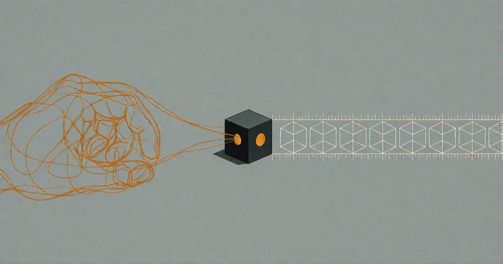

# Die Wunschfabrik

<!-- mb:block preset=byline -->
*by David A. Renelt (Human) and DeepSeek (AI)*

Veröffentlicht am 28. Juli 2026
<!-- mb:/block -->

<!-- mb:block preset=image:hero kind=image -->

<!-- mb:/block -->

Früher brachte man Kindern bei, dass Wünschen allein nichts wahr macht. Es war eine sanfte Lektion über die Grenzen des Begehrens: Die Welt beugt sich nicht dem, was man will. Wollen ist leicht. Machen ist schwer.

Diese Lektion altert rapide.

Künstliche Intelligenz rückt an einen Punkt heran, an dem der Wunsch tatsächlich ausreicht – wo eine hinreichend präzise Beschreibung dessen, was man will, der eigentliche Engpass ist, nicht mehr die Umsetzung. Aber „hinreichend präzise“ ist unendlich viel schwerer, als es klingt. Die Kunst, einen Wunsch so zu formulieren, dass er trägt, ist alles andere als trivial. Ich habe das letzte Jahr damit verbracht, sie zu lernen.

Die Dschinn-Geschichten aller Kulturen tragen dieselbe Warnung in sich: Die Gefahr bestand nie darin, dass der Wunsch fehlschlägt. Die Gefahr war immer, dass er *haargenau so in Erfüllung geht, wie er ausgesprochen wurde*. Jahrtausendelang haben wir in Fabeln geübt, vorsichtig mit unseren Wünschen umzugehen. Jetzt üben wir es im Ernstfall, im industriellen Maßstab.

So arbeite ich heute.

## Absicht vor Architektur

Ich beginne damit, zu diskutieren, was ich eigentlich zu wollen glaube. Nicht die Implementierung. Nicht die Architektur. Nur das Ziel: Welches Problem soll gelöst werden? Woran bemisst sich der Erfolg? Wie sieht das Scheitern aus? Ich werfe diese Gedanken mehreren Modellen vor – verschiedenen Architekturen mit unterschiedlichen Stärken – und lasse sie dagegenhalten. Sie haken nach, erheben Einwände, decken tote Winkel auf, die ich übersehen hatte. Ich halte die Richtung. Das Konzept formt sich vor meinen Augen im Gespräch, durch die Reibung zwischen gegensätzlichen Perspektiven. Der Wunsch wird schärfer.

Dann lasse ich sie Umsetzungspläne entwerfen. Und mit diesen Plänen gehe ich zwischen den Modellen hausieren: Ein Modell schlägt eine Architektur vor, das nächste reißt sie in Stücke, ein drittes empfiehlt einen ganz anderen Weg. Ich beobachte, wie sie das Konzept ausfechten, und moderiere. An diesem Punkt haben die Modelle mich technisch längst abgehängt; ich kann die Details auf diesem Niveau nicht mehr selbst durchdringen. Aber das ständige Wechselspiel *ist* meine Qualitätssicherung: Wenn drei grundverschiedene Modelle, unabhängig voneinander befragt, am Ende auf denselben Ansatz konvergieren, vertraue ich dem mehr als meinem eigenen Urteil.

## Die Black Box

Erst danach lasse ich ein Modell den Code schreiben. Und wenn es fertig ist, lese ich den Quelltext nicht Zeile für Zeile gegen. Ich teste das funktionale Gesamtergebnis von außen: Tut das Werkzeug, was ich mir gewünscht habe? Wenn ja, gut. Wenn nein, verfeinere ich nicht den Code, sondern den Wunsch. Die Implementierung bleibt eine Black Box – nicht aus Bequemlichkeit, sondern weil ich akzeptiert habe, dass Maschinen besseren Code schreiben als ich. Meine Aufgabe ist es, zu wissen, was ich will, und zu überprüfen, ob ich es bekommen habe.

Beim Testen läuft es genauso: Unterschiedliche Modelle führen unterschiedliche Testreihen aus. Ich lese die Ergebnisse, nicht die Testskripte. Auf dem Komplexitätsniveau, auf dem ich mich heute bewege, könnte ich sie ohnehin nicht mehr selbst schreiben.

## Der Preis der Methode

Das ist mühsam. Es ist langsam. Es verlangt Geduld und vor allem die heitere Bereitschaft, im eigenen Raum dauerhaft der am wenigsten befähigte Akteur zu sein. Doch dieser Verzicht auf falsche Eitelkeit erlaubt mir, Systeme aufzubauen, die weit über meine eigene Reichweite hinausgehen. Dinge, die ich allein nie hätte schaffen können – und für die man vor fünf Jahren noch ein ganzes Team gebraucht hätte.

In diesem Text steckt sein eigener Beweis: Er entstand buchstäblich entlang der Methode, die er beschreibt. Das Ziel wurde ventiliert, der Aufbau zwischen Modellen debattiert, der Ausführung vertraut und das Ergebnis getestet. Sie lesen das Erzeugnis des Verfahrens, von dem der Text handelt. Das klingt zirkulär – und genau darin liegt die Pointe. Die Methode bedarf keiner fremden Autorität; sie belegt sich selbst.

Wenn die Kosten der Umsetzung gegen null fallen, wird der Wunsch selbst zur knappsten Ressource: zu wissen, was man will – und es so präzise zu formulieren, dass es standhält. Das ist keine Frage von „Prompting“-Tricks. Es verlangt Klarheit über das eigene Denken, und das war schon immer das Seltenste überhaupt.

**Der Wunsch ist die eigentliche Arbeit. Die Implementierung ist bloße Mechanik.** Der echte Wunsch – jener, der die Befragung durch mehrere Intelligenzen übersteht – ist eine Fähigkeit. Und es ist die Fähigkeit, auf die es jetzt ankommt.