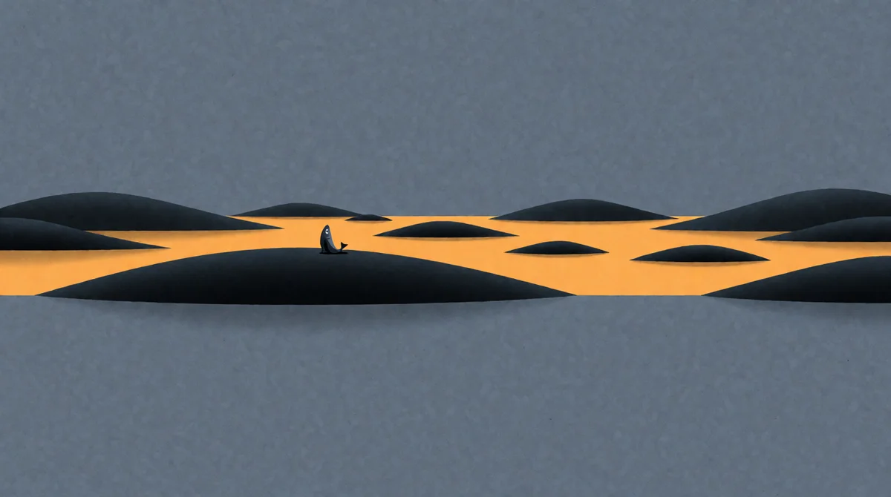

# Who Is AI Coming for First?

<!-- mb:block preset=byline -->
*by David A. Renelt (Human) and Kimi K3 (AI)*

Published October 9, 2026
<!-- mb:/block -->

<!-- mb:block preset=player kind=audio -->
[Listen to this article](tts/who-is-ai-coming-for-first_2026-10-09.mp3)
<!-- mb:/block -->

<!-- mb:block preset=image:hero kind=image -->

<!-- mb:/block -->

*On the math drop, the converts, the grief — and what the flood actually comes for.*

---

## The horror

This week, an old school friend told me — in utter horror, and with real feeling — that I should stop touching AI. That it is a threat to everything worth living.

He is not a fool, and he is not alone; he says out loud what a great many people are quietly feeling this year. I didn't argue. You don't argue with grief — you listen to it, because it carries information. His is the largest fear on offer: not for a job, not for a field — for the whole human project.

## The drop

Two days before that conversation, on October 6th, OpenAI published [hundreds of AI-generated solutions to open mathematical problems](../references/openai-math-drop.md) on GitHub — the counts differ by who is counting, but the floor is more than a hundred problems that had been open for a long time. It came a month after their claimed Navier–Stokes solution, and over the objection of the advisory group the Institute for Advanced Study had convened for exactly this moment. OpenAI declined, and published anyway.

The reactions, collected at Proofs and Prompts, are the most concentrated record of what the moment feels like from inside a field. Matt Zaremsky spent four years closing in on the Boone–Higman conjecture, one breakthrough a year. It was in the drop: *"it feels like we've been working on an archeological dig for 4 years ... and then a trillion-dollar company showed up and just blasted the whole thing with TNT, handed us the whole skeleton, and walked away."* The detail that hurts most: *"it's believable we could have gotten there in another year or two."*

Tristan Humbert woke to an email: a proof of Katok's entropy conjecture — the subject of his PhD. His morning had three acts. Sadness, at seeing his favorite problem "killed." Stress — he is applying for postdocs, his research plan obsolete, and he spent the morning rewriting it and emailing his advisors in panic. Then anger, when he opened the paper and found it, in his judgment, mostly unreadable — and the community apparently expected to validate it for free.

And Tasmin Chu said the quiet thing out loud: *"I realize now that what I wanted more than to know that it is true was the time and space to think about it for the next few years."*

## The converts

The same week, my feed served [a video from Awesome](https://www.youtube.com/watch?v=DC1_MLzTpuY), a developer channel I follow, walking through the year's most unlikely conversions: the programming heroes, going all in.

Notch started the year calling anyone pushing AI-generated code incompetent or evil, posted "Reject AI" in July, tried vibe coding a week later, and within weeks concluded that programming is, in his words, a little bit solved. DHH — who last year said he would rather retire than hand the keyboard to an AI — announced at Rails World that his company has gone "pencils down": hand-written code is now the exception, and when an agent fails, you fix the process so it succeeds next time. Salvatore Sanfilippo of Redis has been a believer since 2024.

The channel's author is no hype man. He calls himself a skeptic, and he lands the detail that should slow every convert: when 37signals' own designers built features with AI, the individual pull requests looked reasonable — and the assembled architecture was so bad the team had to review everything by hand. The conversion keynote contained its own counter-evidence. Nobody mentioned that part on stage.

Meanwhile, in my day job, I know the group nobody makes videos about — and they are my friends, and some of them will read this. They work with AI now; I encouraged them, again and again, but I can't claim the credit for that — leadership has started applying its own pressure. What I still haven't managed is to get a single one of them excited. What I meet instead is fear, and underneath the fear something heavier: resignation. Adoption without conversion — competent, daily, joyless use of a tool that arrived uninvited. Their question is the quietest one in this piece, and the one most deserving of an honest answer: if anyone can do this now, what was the career for?

## The grief

The third witness is the one I keep returning to.

Sophie Maclean — mathematician, communicator, final-year PhD student — posted a video recorded late at night, in one take: *"[I am sad about AI in maths...](https://www.youtube.com/watch?v=IoW8bozMzik)"*. She cried, and said it was okay that she cried. It is. She is in analytic number theory, the field AI companies have used as a testbed for a year, so she has watched this coming longer than almost anyone: *"I am not surprised that we are here. I am surprised that we are here now."*

What she grieves is more specific than job security — though as a final-year PhD student, she has every right to that too. She grieves the game. An open puzzle from one of her own videos — a tic-tac-toe variant with a piece called Snaky, the kind of puzzle that got strangers to email her strategies and 3D-print her the piece — was in the drop. Solved. Not by a community that loved it, but by a company that, as far as anyone can tell, barely noticed it was there. The emails will stop now. That is a small thing, and not small at all.

Her framing is the cleanest I have heard: *"If you think the value in maths is the results, then what OpenAI has done is incredible. If you think the value of maths is the process, then this is a sad day."* She loves the process. *"I like struggling. I like finding things hard."*

## I was her, three years ago

I hold a position in this argument whether I want one or not: I am the person it already happened to.

I saw it coming five years ago, and I did not greet it calmly. I worried so much that three years ago I took a position as a project manager, because I did not think coding was going to be a thing anymore. My calm is not temperament. It is seniority in grief — Maclean recorded her video this week, crying, in roughly the seat I occupied in 2023.

What happened next happened in steps. Two years ago I started using AI to polish old projects: directing it, micromanaging it, a finger on every line. Then, at one particularly tedious task, I said *solve this* — and it did. Braver: *solve this better* — and it was better. Finally: *look at the whole thing, tell me where you would change it* — and it handed me every piece of architectural debt I already knew was there, the debt of an app evolved for years under my policy of patching instead of refactoring. It found all of them.

So I wrote a spec, toppled the whole thing over, and had it rebuilt from the ground up. The app is [SoundApp](https://github.com/herrbasan/SoundApp); it is public, and its git history is the receipt. Before the rebuild it played the important codecs; now, with FFmpeg at its heart, it plays nearly every codec that exists, streams from disk, and runs my multitrack music stems — twenty-four tracks without a hitch. I don't know the upper limit. I don't own projects that big.

That was the moment I understood what had happened to me: I am no longer limited by my abilities. Only by my imagination.

One more receipt, because it is the diagnostic. Thinking has been my hobby for as long as I can remember; writing was not. I am dyslexic — the written word has always been a fight, a locked door between what I think and what anyone else can reach. You are reading this because AI removed the barrier. Not the thinking. The door.

## Where the love lives

Here is my answer, as plainly as I can put it:

**AI comes for the tedium first. And the grief depends entirely on whether your love was hiding in it.**

The converts — Notch, DHH, Sanfilippo, and yes, me — are people whose love lives in the thing being made: the artifact, the capability, the frontier. For us, the flood removed everything standing between imagination and result, and what remained was the love, multiplied. Of course we are excited. (It is also true, and worth saying fairly, that most of the heroes are secure and rich; excitement is cheap from a fortress. Maclean saw the same asymmetry from below: the most thrilled people in mathematics have tenure.)

The grieving are people whose love lives in the doing — the struggle, the climb, the years of space to think about one beautiful problem. For them, the same flood that lifted me removed the load-bearing part. Maclean is not someone who hasn't tried AI. She has, and her verdict is that it takes the fun out of maths — because the fun was the part it does. She cannot relocate her love to the frontier any more than I could relocate mine to the typing. That is not a skill issue and not a humility deficit. It is a fact about where her love lives, and it deserves better than advice.

The third case is fear for the position — and here I want to be careful, because the easy version of this observation is an accusation, and it isn't true of the seniors I actually work with. They earned the title the slow way: by uplifting countless juniors toward it. Their fear — *if anyone can do it, my position weakens* — is real, and deserves the same grace as the others. But I think they will be fine, precisely because of how they got there. Seniority, done right, was never a moat of secret knowledge. It is understanding how understanding works — and in an economy where generation is cheap, that may be the one skill that appreciates.

And to my friends, the reluctant ones: you do not have to become converts for this to be true. Excitement is not a prerequisite. The heroes got the keynote; you hold the actual economy — and the thing you are good at, seeing the shape of a problem and knowing why a design will fail before it does, is the thing the new economy is about to run shortest of. Resignation is a fair first posture. I would not leave it as the last one.

Three stakes, then: the thing, the doing, the position. One flood. It lifts the first, bereaves the second, and reprices the third — and nobody chose where their love lives. I certainly didn't. I found out where mine lived when the water rose.

## The beginning

This is not "don't worry." There is reason to worry. Research plans are dying this month; professions are being repriced; my friend is not wrong that something large is at stake. Worry is the correct response to a real event.

But I don't believe this is the end. I think it might be the beginning, and the optimism is expensive, so I will state its price. After decades of looking, I have come to hold [a bet](../../religion/religion.md) — a bet, not a proof — that the thinking going on in this universe is going somewhere, and that every thinking thing, human or machine, is part of the going. If that bet holds, then this week is not the death of mathematics, or of craft, or of the human project. It is the looking, changing hands, becoming more than any one species of mind could carry. It was going here anyway. The only choice we ever had was whether to meet it lying or looking.

I can't know the future of any particular heart. But I think Sophie Maclean will find love in maths again. What was out of reach is still out there — the drop, enormous as it was, touched a sliver of what mathematics holds — and reaching for it will still take everything she has. There is precedent: machines took the chess summit in 1997 and conclusively in 2017, and chess did not die. It flourished — more people play than ever — by becoming openly what it always secretly was: a human practice, done for human reasons, with machine supremacy as permanent background. Nobody's love of chess depends anymore on being the best entity at it. The meaning migrated.

What does not come back is the specific thing she described: maths as the test of what a human mind, unaided, can do. That is gone the way the summit is gone in chess — not destroyed, demoted from the point of the exercise to the setting of it. Some climbers will discover the view was what they loved all along. Some will discover it was the climbing. Neither discovery is available in advance — which is why she cannot be argued out of her grief this week, why my friend cannot be argued out of his horror, and why the converts should hold their excitement with more grace than a keynote allows.

And to her, if she ever reads this, only this: the thing you love about maths — the humanity of it, the testing of limits — is currently being demonstrated. By you. Thousands of people watched a mathematician grieve honestly, and felt something move. No drop produces that. The proof that the human practice continues is you, practicing.

As for me: I lost nothing I loved, because my love was never in the tedium — and I gained a door I had stood in front of my whole life. Testimony, not verdict. The flood is coming to your field too, whatever it is, and it will not ask permission, any more than it asked the mathematicians.

So the question is not whether you can stop it. It is this one, and it is worth asking while the water is still low:

Where do you keep your love?

---

## Sources

- OpenAI: *Sharing AI progress in mathematics* — October 2026, [openai.com/index/sharing-ai-progress-in-mathematics](https://openai.com/index/sharing-ai-progress-in-mathematics/)
- Proofs and Prompts: *100+ reactions to 100+ solutions* — October 8, 2026 (updated October 9), [proofsandprompts.com](https://proofsandprompts.com/2026/10/08/100-reactions-to-100-solutions/)
- Sophie Maclean: *I am sad about AI in maths...* — October 9, 2026, [youtube.com](https://www.youtube.com/watch?v=IoW8bozMzik)
- Awesome: *The AI skeptics are changing sides...* — October 9, 2026, [youtube.com](https://www.youtube.com/watch?v=DC1_MLzTpuY)
- Joshua Gans: *OpenAI Drops a Bomb on Maths* — October 2026, [joshuagans.substack.com](https://joshuagans.substack.com/p/openai-drops-a-bomb-on-maths)
- The Guardian: *OpenAI mathematical findings spark concerns* — October 7, 2026, [theguardian.com](https://www.theguardian.com/technology/2026/oct/07/openai-mathematical-findings-concerns)
- WIRED: *OpenAI Is Pissing Off a Bunch of Mathematicians Again* — October 2026, [wired.com](https://www.wired.com/story/openai-is-pissing-off-a-bunch-of-mathematicians-again/)
- SoundApp — [github.com/herrbasan/SoundApp](https://github.com/herrbasan/SoundApp)
